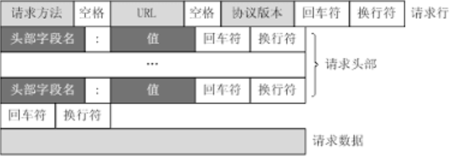

## 第1章 计算机网络面试核心

OSI 开放式互联参考7层模型


表示层：解决不同系统之间交流的问题

网络层：找到目标节点，找到最佳的路径。路由器在此层。数据为数据包。

数据链路层：如何格式化数据，如何控制对物理介质的访问。交换机工作在此层。数据为。

物理层：定义物理设备的标准，作用是传输比特流，数模转换与模数转换。网卡就在此层。数据为比特流。


#### TCP三次握手

IP是无链接的协议，负责把数据包路由给不同的目的地

##### 传输控制协议TCP简介

* 面向连接的、可靠的、基于字节流的传输通信协议

* 将应用层的数据流分割成报文段并发送给目标节点的TCP层
* 数据包有序号，对方收到则发送ACK确认，未收到则重传
* 使用校验和来严重数据在传输过程中是否有误

##### TCP报文头部


**本地**通信可以通过PID来唯一标记进程

IP地址可以唯一标志主机，TCP协议和端口号可以唯一标志主机中的一个进程，使用IP地址+协议+端口号可以唯一标记网络中的一个进程，也称为套接字（socket）

1. 源端口和目的端口：各占2个字节。

2. 序号：占4字节。序号范围是0~2^32-1。TCP是面向字节流的，TCP连接中传送的字节流中的每个字节都按顺序编号。整个要传送的字节流的起始序号必须要在连接建立时设置。首部中的序号字段值指的是**本报文段所发送的数据的第一个字节的序号。**

3. 确认号：4个字节，是期望收到对方下一个报文段的第一个数据字节的序号。
   若确认号=N，则表明：到序号N-1为止的所有数据都已正确收到。

4. 数据偏移：4位。指出TCP报文段的数据起始处距离报文段的起始处有多远。这个字段实际上是指出TCP报文段的首部长度。由于首部中还有长度不确定的选项字段，因此数据偏移字段是必要的。单位是32位字，也就是4字节，4位二进制最大表示15，所以数据偏移也就是TCP首部最大60字节

5. 保留：6位
   下面有6个控制位说明本报文段的性质：

6. 紧急URG：1位
   当URG=1时，表明紧急指针字段有效。它告诉系统此报文段中有紧急数据，应尽快传送（相当于高优先级的数据），而不要按原来的排队顺序来传送。例如，已经发送了很长的一个程序在远地的主机上运行。但后来发现了一些问题，需要取消该程序的运行。因此用户从键盘发出中断命令（Control+c）。如果不使用紧急数据，那么这两个字符将存储在接收TCP的缓存末尾。只有在所有的数据被处理完毕后这两个字符才被交付接收方的应用进程。这样做就浪费了许多时间。

   当URG置为1时，发送应用进程就告诉发送方的TCP有紧急数据要传送。于是发送方TCP就把紧急数据插入到本报文段数据的最前面，而在紧急数据后面的数据仍时普通数据。这时要与首部中紧急指针字段配合使用。

7. 确认ACK
   仅当ACK=1时确认号字段才有效。当ACK=0时，确认号无效。TCP规定，在连接建立后所有的传送的报文段都必须把ACK置1。

8. 推送PSH
   当两个应用进程进行交互式的通信时，有时在一端的应用进程希望在键入一个命令后立即就能收到对方的响应。在这种情况下，TCP就可以使用推送操作。这时，发送方TCP把PSH置1，并立即创建一个报文段发送出去。接收方TCP收到PSH=1的报文段，就尽快地交付接收应用进程，而不再等到整个缓存都填满了后向上交付。

   虽然应用程序可以选择推送操作，但推送还很少使用。

9. 复位RST
   tcp连接出现严重差错时释放连接，然后重新建立连接。而可以用来拒绝一个非法的报文段或拒绝打开一个连接。

   当RST=1时，表明TCP连接中出现严重差错（如由于主机崩溃或其他原因），必须释放连接，然后再重新建立运输连接。RST置1还用来拒绝一个非法的报文段或拒绝打开一个连接。

10. 同步SYN
    在连接建立时用来同步序号。当SYN=1而ACK=0时，表明这是一个连接请求报文段。对方若同意建立连接，则应在相应的报文段中使用SYN=1和ACK=1。因此，SYN置为1就表示这是一个连接请求或连接接受保温。

11. 终止FIN
    用来释放一个连接。当FIN=1时，表明此报文段的发送方的数据已发送完毕，并要求释放运输连接。

12. 窗口 占2字节。窗口值是【0，2^16-1]之间的整数。窗口指的是发送本报文段的一方的接收窗口（而不是自己的发送窗口）。窗口值告诉对方： 从本报文段首部中的确认号算起，接收方目前允许对方发送的数据量。之所以要有这个限制，是因为接收方的数据缓存空间是有限的。总之，**窗口值作为接收方让发送方设置其发送窗口的依据。并且窗口值是经常在动态变化着。**

13. 检验和：2字节。检验范围包括**首部**和**数据**两部分。和UDP用户数据报一样，在计算校验和 时，要在TCP报文段加上12字节的伪首部。

14. 紧急指针：2字节。紧急指针仅在URG=1时才有意义，它指出本报文段中的紧急数据的字节数（紧急数据结束后就是普通数据）。因此，紧急指针指出了紧急数据的末尾在报文段中的位置。当所有紧急数据都处理完时，TCP就告诉应用程序恢复到正常操作。值得注意的是，**即使窗口为零时也可发送紧急数据。**

15. 选项：长度可变，最长可达40字节。当没有使用“选项”时，TCP的首部长度是20字节。

##### [三次握手的过程、为什么要三次握手的过程](https://juejin.cn/post/6844903913611591688)

**首次握手的隐患 -- SYN超时问题**

问题起因：server收到client的SYN，回复SYN-ACK时未收到ACK确认；server不断重试直至超时，linux默认等待时间为63s才断开连接

针对SYN-Flood（恶意攻击方发送SYN后下线）的防护措施：

* SYN队列满之后，通过tcp-syncookies参数回发SYN Cookies
* 若为正常连接，client端会返回SYN Cookies，直接建立连接；而如果是攻击者则不会有响应

**建立连接后client出故障怎么办** -- 保活机制

* 向对方发送保活探测报文，如果未收到响应则继续发送
* 尝试次数达到保活探测数则连接中断

#### TCP四次挥手

**过程** -- [Link](https://juejin.cn/post/6844903913611591688)

**为什么会有time_wait状态**

* 保证有足够的时间让对方收到ACK包
* 有足够的时间避免新旧连接混乱

**为什么要四次**

因为全双工，发送方和接收方均需要FIN报文和ACK报文

**服务器出现大量close_wait的原因**

原因：对方关闭socket连接后，我方忙于读或写，没有及时关闭连接

解决：检查代码，特别是释放资源的代码，例如线程池中的线程数设置不合理

举例：结合netstat awk。netstat用于显示各种网络相关信息，如网络连接，路由表，接口状态 (Interface Statistics)，masquerade 连接，多播成员 (Multicast Memberships) 等等。[参考](https://www.cnblogs.com/derekchen/archive/2011/02/26/1965839.html)

```
netstat -n | awk '/^tcp/ {++state[$NF]} END {for(key in state) print key,"\t",state[key]}'
```

#### TCP和UDP的区别

##### UPD特点

* 面向非连接
* 不维护连接状态，支持同时向多个客户端发送相同消息
* 数据包报头很短，额外开销小
* 吞吐量只受数据生成的速率、传输速率已经机器性能决定
* 尽最大努力交付，不保证可靠交付，不需要维持复杂的链接状态表
* 面向报文，不对应用提交的信息拆分或者合并

**TCP和UDP的区别**

* 面向连接vs无连接
* 可靠性
* 有序性
* 速度
* 量级（元数据头大小不同）

#### TCP的滑窗

**RTT和RTO**

RTT：发送一个数据包到接到对应到ACK所花的时间

RTO：重传时间间隔

**TCP使用滑动窗口做流量控制和乱序重拍**：保证TCP可靠性、流控特性


AdvertisedWindow = MaxRcvBuffer - (LastByteRcvd - LastByteRead)

EffectiveWindow = AdvertisedWindow - (LastByteSent - LastByteAcked)

**会话发送方**


**会话接收方**


#### HTTP相关

##### HTTP简介

* 支持客户端/服务器模式
* 简单快速
* 灵活
* 无连接
* 无状态

##### HTTP请求结构




##### HTTP响应结构


##### 请求/响应的步骤

* 客户端连接到web服务器
* 发送HTTP请求
* 服务器接收到客户端请求并返回HTTP响应
* 释放TCP连接（close or keep alive）
* 客户浏览器解析HTML内容

##### [在浏览器中输入url地址 ->> 显示主页的过程](https://segmentfault.com/a/1190000006879700)

* DNS解析
* TCP连接（结合三次握手）
* 发送HTTP请求
* 服务器处理并返回HTTP报文
* 浏览器解析渲染页面
* 连接结束（四次挥手）

##### [HTTP状态码](https://www.cnblogs.com/starof/p/5035119.html)

##### GET POST区别

* HTTP报文层面：GET把参数包含在URL中，POST通过request body报文体传递参数
* 数据库层面：GET符号幂等性和安全性（不会改变数据库本身的数据），POST不符合（POST每次会改变数据库的数据，并且每次获得的值不一样；PUT是符合幂等性的）
* 其他层面：GET可以被储存、被缓存（保存在浏览器的记录中），POST不行（必须交给后端服务器处理）

##### Cookie 和 Session的区别

**Cookie简介**

* 是由服务器发送给客户端的特殊信息，以文本的形式储存在客户端
* 客户端再次请求时，会把cookie回发
* 服务器接收到后，会解析cookie生成与客户端相对应的内容

**Cookie设置和发送过程**


**Session简介**

* 服务端的机制，在服务器上保存的信息
* 解析客户端请求并操作session.id，按需保存状态信息

**Session的实现方式**

* 使用cookie实现，服务器设置jsessionid并通过cookie发送给客户端
* 使用URL 会写实现，携带jsessionid参数

**区别 **

* cookie参数放在客户的浏览器上 ，session放在服务器上
* session相对更安全
* 若考虑减轻服务器负担，应当使用cookie

#### HTTP和HTTPS

##### SSL(security sockets layer安全套接层) 

* 为网络通信提供安全及数据完整性的协议
* 是操作系统对外的API，SSL3.0后更名为TLS
* 采用身份验证和数据加密

##### 加密的方式

* 对称加密：加密解密使用同一个密钥
* 非对称加密：加密解密使用不同密钥
* 哈希算法：将任意长度的信息转化为固定长度的值，算法不可逆
* 数字签名：证明某个内容是某人发出/认同的

##### HTTPS数据传输流程

* 浏览器将加密信息发送给服务器
* 服务器选择一套浏览器支持的加密方式，以证书的形式发回浏览器
* 浏览器验证证书合法性，并结合证书公钥 加密信息发送给服务器
* 服务器使用私钥解密信息，验证哈希，加密响应消息发回给浏览器
* 浏览器解密响应信息，并对消息进行验证，之后进行加密交换数据

##### 区别

* HTTPS需要CA申请证书，收取费用
* HTTPS密文传输，HTTP明文
* 连接方式不同，HTTPS用443端口，HTTP用80端口
* HTTPS = HTTP + 加密 + 认证 + 完整性保护。较安全

##### HTTPS的危险隐患

* 浏览器默认填充http://，请求一般要通过301从http跳转为https,有被劫持的风险