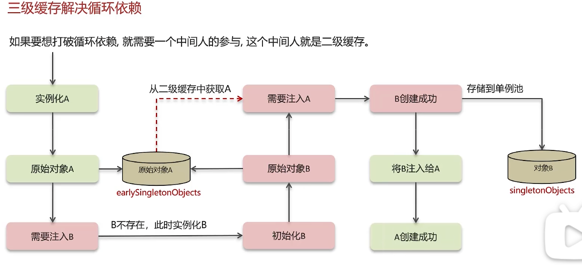

# 第9章 Java框架-SpringFramework/SpringBoot/SpringCloud

## Spring Framework
### Spring的单例bean是线程安全吗？
不是。Spring中scope默认是singleton。一般在spring中的bean都是无状态的，所以不存在线程安全问题。如果bean中定义了可修改的成员变量就需要考虑线程安全问题。
### 什么是AOP，项目中有用到吗？
面向切面编程（AOP），将与业务无关但却与对个对象相关公共行为逻辑抽取出来，降低耦合。

常见场景： 记录操作日志（环绕通知+切点表达式）/记录请求完成的时间/缓存处理/spring中内置的事务处理（@Transactional）
#### 核心概念：
* 切面（Aspect）：横切逻辑的封装，如打印日志、事务、权限处理。（在代码相似的位置进行同样的处理）
* 通知（Advice）：切面的具体逻辑，通知有五种类型，分别是前置通知（@Before）、后置通知（@After）、返回通知（@AfterReturning）、异常通知（@AfterThrowing）和环绕通知（@Around）。前四种通知都是在目标方法的前后执行，而环绕通知可以控制目标方法的执行过程。
* 切点（Pointcut）：定义通知作用的位置，通过正则表达式（如execution(* com.example.service.*.*(..))）匹配方法。 
#### 实现原理：
* 动态代理：JDK 动态代理（基于接口）和 CGLIB（基于子类）。Spring 默认优先使用 JDK 代理，目标类无接口时用 CGLIB。
* 织入（Weaving）：在运行时将切面逻辑插入目标方法。

#### Spring事务是如何实现的？
支持编程式事务和声明试事务，
* 编程式：TransactionTemplate实现，对代码侵入性大很少使用。
* 声明试：底层利用aop切面，在方法前后进行拦截，将事物的处理功能写在拦截方法中。执行前开启事务，之行结束后根据结果回滚或者提交。
* Spring 并不直接管理事务，而是提供了多种事务管理器。Spring 事务管理器的接口是：PlatformTransactionManager。通过这个接口，Spring 为各个平台如：JDBC(DataSourceTransactionManager)、Hibernate(HibernateTransactionManager)、JPA(JpaTransactionManager)等都提供了对应的事务管理器，但是具体的实现就是各个平台自己的事情了。

#### Spring中事务失效的场景
* 情况1 异常捕获： 事务只有出现了异常才会回滚，如果自己处理了异常（try--catch）事务无法知道
* 解决1: catch之后再重新跑出新的runtimeException
* 情况2：抛出checkedException（例如fileNotFoundException）
* 解决2: spring默认只会回滚非检查异常（runtimeException），可以通过@Transactional(rollbackFor=Exception.class）解决
* 情况3: 非public方法导致的事务失效
* 解决3: spring为方法创建代理添加事务等都是基于public方法，改为public方法解决

#### Spring bean的生命周期
BeanDefinition(XML) --> 构造函数(实例化bean) -->依赖注入（@Autowire/@Value）--> aware接口（ApplicationContextAware）
--> beanPostProcessor#before 
--> 初始化方法(initializingBean/自定义init方法) 
--> beanPostProcessor#after(AOP -- 动态代理)
-->销毁bean
#### spring如何解决循环依赖
循环依赖也就是循环引用，spring中允许循环依赖，单例模式产生的循环依赖都可以通过Spring三级缓存解决

**singletonObjects**一级缓存: 单例对象池，存已经初始化完成的bean

**earlySingletonObjects**二级缓存: 早起的bean对象，生命周期还未走完

**singletonFactories**三级缓存： 存对象工厂，用来创建对象




 
若是构造函数产生的循环依赖可通过lazy init来解决

#### 依赖注入（DI）与控制反转（IoC）

1. 核心原理：IoC是设计思想， DI是手段
* IoC(Inversion of Control)：不通过 new 关键字来创建对象，而是通过 IoC 容器(Spring 框架) 来帮助我们创建对象。我们需要哪个对象，直接从 IoC 容器里面去取即可。IoC 容器实际上就是个 Map（key，value）,Map 中存放的是各种对象。
* DI(Dependency Injection)：是IoC 的具体实现，容器通过构造器、字段或 setter 方法注入依赖。
    
   ```java
   //正转
   public class A
   {
       private B _b;
       public A()
       {
       // 因为A掌控B的创建，因此A控制了B，此为“正转”
       _b = new B();
       }
   }
   //反转
   public class A
   {
       private B _b;
    
       // B由外部注入，称之为依赖注入
       public A(B b)
       {
           // B由外部创建，脱离了A的控制，称之为控制反转
           _b = b;
       }
   }
   ```
2. 源码流程：容器启动时解析配置（如@Component），注册BeanDefinition；实例化 Bean 时通过反射创建对象，调用populateBean()完成属性注入。
3. 关键知识点
* 注入方式：构造器注入（线程安全）、字段注入（简洁但不可测试）、setter 注入（灵活）。
* 自动装配：@Autowired按类型匹配，@Qualifier指定名称，@Resource按名称匹配（JDK 注解）。
4. 面试题：
* 为什么推荐构造器注入？（确保依赖不可变，避免 NPE）
* @Autowired和@Resource的区别？（依赖查找策略不同）

## SpringMVC
### 执行流程
视图阶段（老旧的jsp）/前后端分离阶段(接口 异步开发）

**视图阶段**
* dispatcherServlet: 前端控制器--调度中心，接受所有请求
* handlerMapping: 处理器映射器--通过路径找到对应方法，如果有拦截器也一起处理
* handlerAdaptor：处理适配器--执行handler，处理handler中的参数和返回值
* viewResolver视图解析器：将逻辑视图转化为真正的视图返回给页面


**前后端分离**
* 用户请求发给dispatcherServlet
* dispatcherServlet收到请求调用handlerMapping
* handlerMapping找到具体的处理器，生成处理器对象，如果有拦截器也一起打包返回给dispatcherServlet
* dispatcherServlet调用handlerAdaptor
* handlerAdaptor经过适配调用具体的处理器（controller/handler）
* 方法上添加了@Responsebody
* 通过httpMessageConverter转化为json并相响应


### 异步请求
https://blog.csdn.net/zengfanwei1990/article/details/111026239


## Spring Boot

Spring Boot 只是简化了配置，如果你需要构建 MVC 架构的 Web 程序，你还是需要使用 Spring MVC 作为 MVC 框架，只是说 Spring Boot 帮你简化了 Spring MVC 的很多配置，真正做到开箱即用！

### 自动配置原理（高频）
Springboot项目上有一个注解@SpringbootApplication,是对三个注解的封装@SpringbootConfiguration @EnableAutoConfiguration @ComponentScan

* ```@EnableAutoConfiguration```是自动配置的核心，通过```AutoConfigurationImportSelector```加载```META-INF/spring.factories```中的配置类，根据条件注解（如@ConditionalOnClass）动态启用配置。
* 条件注解：```@ConditionalOnMissingBean```（无自定义 Bean 时生效）、```@ConditionalOnProperty```（配置文件存在特定属性）。

### Starter 作用：
* 一站式依赖管理，如spring-boot-starter-web自动引入 Tomcat、Spring MVC 等依赖。
* 自定义 Starter 需在spring.factories中声明自动配置类。

### 企业级开发最佳实践
1. 配置管理：
   * 多环境配置：通过application-{profile}.properties或application.yml的spring.profiles块切换环境，优先级为：命令行参数 > 配置文件 > 系统属性。
   * 外部化配置：@Value注入单个属性，@ConfigurationProperties绑定复杂配置类。
2. 性能优化：
   * 缓存：@EnableCaching+@Cacheable，支持 Redis、Ehcache 等。
   * 异步处理：@Async配合线程池提升响应速度。
3. 监控与运维：
   * Actuator：暴露健康检查（/health）、指标（/metrics）等端点，可通过management.endpoints.web.exposure.include配置暴露范围。
   * 日志：使用 Slf4j+Logback，通过logging.level调整日志级别。

### 企业级应用搭建
1. 分层架构：
   * Controller：处理请求，返回结果（@RestController）。
   * Service：封装业务逻辑，调用 DAO。
   * DAO：数据访问层（@Repository），使用 Spring Data JPA 或 MyBatis。
2. 事务管理：
   * @Transactional声明式事务，默认回滚运行时异常。
   * 事务传播行为（PROPAGATION_REQUIRED、PROPAGATION_REQUIRES_NEW）。
3. 异常处理：
   * @ControllerAdvice+@ExceptionHandler全局捕获异常，返回统一格式响应。

### 面试题：
* Spring Boot 如何实现零配置？（自动配置 + Starter）
* 如何禁用某个自动配置？（@SpringBootApplication(exclude = ...)）
* 自定义 Starter 的步骤是什么？(spring.factories中声明自动配置类)
* Spring 与 Spring Boot 的区别：
  * Spring：需手动配置，灵活性高；Spring Boot：自动配置，开箱即用。
* Bean 的生命周期：
  * 实例化 → 依赖注入 → BeanPostProcessor前置处理 → 初始化（@PostConstruct） → BeanPostProcessor后置处理 → 销毁（@PreDestroy）。
* 循环依赖的处理：
  * 单例 Bean 通过三级缓存解决，Prototype Bean 需避免循环依赖。/Use @Lazy
* AOP 的底层实现：
  * JDK 动态代理生成接口代理类，CGLIB 生成目标类的子类。
* 如何实现多环境数据库配置？
* Actuator 的主要端点有哪些？如何保护敏感端点？
* 如何优化 Spring Boot 应用的启动速度？

## SpringCloud
5大组件： 注册中心Eureka，负载均衡Ribbon，远程调用Feign，服务熔断Hystrix，网关Zuul/Gateway

### spring如何实现服务注册和发现的？
服务注册：服务实例启动时会把自己注册到eureka，比如端口名，服务名称，ip等

服务发现：消费者向eureka拉取服务信息，如果有集群则通过负载均衡选择一个服务

服务监控：服务提供者每30s发送心跳给eureka，如果90秒没有收到心跳就会将服务从列表删除

### Ribbon如何实现负载均衡
客户端向ribbon发起请求，ribbon通过eureka获得所有服务列表，通过一定的负载均衡规则来选取合适的实例。

具体的负载均衡方式有：
* **RoundRobinRule** 轮询
* **WeightedResponseTime** 响应时间越长权重越小
* **RandomRule** 随机
* BestAvailableRule 选择并发数最小的服务器
* retryRule
* availabilityFilteringRule 过滤掉非健康的，再根据并发数选择小的
* **ZoneAvoidanceRule**（默认）按区域划分，在区域内轮询

## 业务相关微服务面试题
### 服务有没有做过限流？
先介绍业务（qps 是多少？）：特殊日期会有突发流量，qps达到2000，平时只有30-50，需要合理的限流

限流方式
* Tomcat:设置最大连接数，单体适用，微服务不适用
* **Nginx**:漏桶算法
  * 控制速率（突发流量）：使用漏桶算法来控制速率，漏桶储存请求，以统一的速率发送请求，多余的请求等待或抛弃
  
  * 控制并发连接数
  
* 网关限流：令牌桶限流