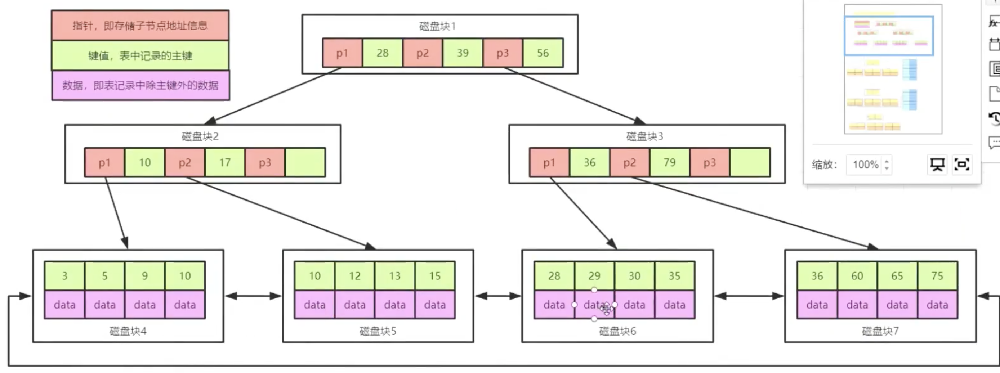

## 第二章 数据库

### 如何设计数据库

RDBMS

* 程序实例：存储管理，缓存机制，SQL解析，日志管理，权限划分，容灾机制，**索引管理**，**锁管理**
* 存储（文件系统）

### 索引模块

#### 什么是索引

* 索引是帮助MYSQL获取数据的数据结构
* 索引储存在文件系统中

#### 索引的数据结构

索引文件的结构：hash，bitmap，二叉树，B树，B+树

[Data structure visualization](cs.usfca.edu/~galles/visualization/Algorithms.html)

**Hash**

* 在mysql中只有memory的存储引擎显示支持哈希索引

* 缺点
  1. 需要把所有的哈希值都存在内存中，消耗内存空间
  2. 只包含哈希值和行指针而不存储字段值，不能避免表扫描
  3. 等值查询确实很快("=", "IN")，工作中范围查询用得多，速度很慢，不适合; 在内存中会使用hash查询，因为内存速度极快，不在乎这些时间
  4. 无法被用来避免数据的排序操作，因为哈希值和实际大小无关
  5. 不能利用部分索引键查询，必须精确匹配到所有索引才有效
  6. 碰撞多的话效率极低

**二叉查找树 O(logn)** 

极端情况会出现线性二叉树，可以利用树的平衡特性旋转得到，保持O(log n)

检索深度每增加1都会增加一次IO次数，性能降低，每个结点只能存2个子结点，树的深度会很深，性能受损

**B Tree**

* 定义：根节点至少2个孩子；树中每个节点最多m个孩子(m阶)；除根节点和叶子节点外，其他每个节点至少ceil(m/2)个孩子；所有叶子节点都在同一层


* 每个节点占用一个磁盘块，一个节点上有两个升序排列的关键字和三个指向子树根节点的指针，指针储存的是子节点所在磁盘快的地址。两个关键字划分三个范围域分别对应三个指针指向的子树的数据的范围。

* 查找关键字的过程
  1. 根据根节点找到磁盘块1，读入内存【磁盘I/O第一次】
  2. 比较关键字28在区间（16，34），找到磁盘块1的指针P2
  3. 根据P2找到磁盘块3，读入内存【磁盘I/O第二次】

**B+ Tree**



* 非叶子节点指针与关键字个数相同；非叶子节点的子树指针P[i]指向关键字值[k[i], k[i+1])的子树；前几层只存索引，叶子结点存数据
* B+树有两个头指针，一个指向根节点，另一个指向关键字最小的叶子节点，而且所有叶子节点之间是一种链式结构。因此可以有两种查找方式：1 对主键进行范围查找或分页查找，2 从根节点进行随机查找；具体使用哪一种mySQL 中的优化器会自己选择
* B+树更适合存储索引
  * 磁盘读写代价更低：内部节点不存数据，节点相对大小更小，每次读入内存的量相对低
  * 查询效率更加稳定：每个关键字的查找都必须走完完整的根节点到叶子节点的路，O(logn)
  * 更有利于对数据库的扫描：可直接遍历叶子节点
* B+树有几层？根据索引的存储类型决定，int层数比varchar浅，所以索引越小越好

**BitMap**

* Oracel数据库支持位图索引
* 
* 缺点：锁强度极大，不适合高并发

#### 引擎和索引

聚簇索引，非聚簇索引：数据是否和索引是放在一起的

##### InnoDB-聚簇索引


* 若主键被定义，主键为聚簇索引；若没有主键，该表的第一个唯一键作为聚簇索引；如果没有唯一键，那么会生成一个6字节的row_id作为隐藏主键作为聚簇索引
* innoDB必须有主键：因为聚簇索引的叶子节点不存储数据的物理地址而是存储的是相关的键位值和对应的主键，所以非主键所以包含了两次查找，需要回表，影响性能
* 建议主键自增吗？单机非常推荐（不然维护起来非常难，会造成页分裂叶合并），分布式不推荐（分布式可了解一下雪花算法）

##### MyISAM-非聚簇索引


##### 比较

[MyISAM与InnoDB区别](https://segmentfault.com/a/1190000008227211)


innoDB 两个文件：frm结构，数据和索引在一个文件

myisam三个文件：结构，索引和数据是分开存的

#### 如何定位并优化慢查询SQL

* 根据慢日志定位慢查询SQL

  ```sql
  show variables like "%quer%";
  show status like "%slow_queries%";
  set global slow_query_log = ON;
  set global long_query_time = 1;
  ```

* 使用explain等工具分析sql
  * type由好到坏的顺序为：system > const > eq_ref > ref > range > *index*  *>* *ALL*
  * extra出现一下两种情况说明不能使用索引
    - Using filesort,说明mysql会对数据使用一个外部的索引排序,而不是按照表内的索引顺序进行读取。可能在内存或磁盘中排序。MySQL中无法利用索引完成的排序操作称为"文件排序"
    - Using temporary,使用临时表保存中间结果,MySQL在对查询结果排序时使用临时表。常见于order by和group by
* 修改sql使其尽量用索引

#### 联合索引之最左匹配

* 组合索引：比如省-市-区三级联动

* 最左前缀匹配原则：mysql会一直向右匹配知道遇到范围查询(>, <, between, like)就停止匹配
* 最左前缀匹配成因：
  1. Mysql创建联合索引是首先会对最左边，也就是第一个索引字段进行排序
  2. 在第一个排序的基础上，再对第二个索引字段进行排序
  3. 所以第一个字段是绝对有序的，而第二个字段就是无序的了
  4. 因此通常情况下，直接使用第二个字段进行条件判断是用不到索引的。

* 例如 name, age (name, age)

​		where name =? and age = ?

​		where age =? and name = ?

​		where name =? 

​		where age = ?

​		1,2,3使用索引，4索引失效

​		in 和 = 可以乱序，因为优化器会把索引优化成可识别的形式

#### 索引越多越好吗

数据量大时才能体现出索引的优势，数据量很小的时候，触发回表产生的IO消耗远大于效率。

数据变更需要维护索引，维护成本增加

### 锁模块之MyISAM

#### MyISAM 与InnoDB关于锁的区别

* MyISAM默认表级锁，不支持行锁

* InnoDB默认行级锁，也支持表锁

如何显示的给表加锁： `lock tables info_table read ｜ write;`

如何释放锁：`unlock tables;`

读锁是共享锁，写锁是排它锁；

读锁也可以加排它锁：`select* ... for update;`

innoDB支持事物，自动commit； 而实际中是二段锁，先统一加锁，在commit时再解锁；

innoDB关闭自动提交：`set autocommit =0; ` 

如何显示的给表加共享锁：`select* ... loock in share mode;`

InnoDB如果语句使用索引，涉及到的所有行都会被加锁（行锁）；如果语句不使用索引，整张表都会被锁（表锁）。

#### MyISAM适合的场景

* 频繁执行全表count语句：innoDB不保存行数每次都需要再次计数，myisam只需要读出行数即可
* 对数据的增删改频率不高，查询很频繁
* 没有事物

#### InnoDB适合的场景

* 数据增删改很频繁
* 可靠性要求高，要求支持事物

#### 数据库锁的分类

* 按粒度：表级锁，行级锁，页级锁
* 按锁级别：共享锁，排它锁
* 按上锁方式：自动锁，显式锁
* 按使用方式：乐观锁(不使用数据库的锁机制，一般通过记录数据版本：1 使用版本号，2 使用时间戳)，悲观锁(大多依靠数据库本身的锁机制，额外开销大，死锁的机会大)

#### 数据库事物

##### ACID

* A：Atomic，原子性，将所有SQL作为原子工作单元执行，要么全部执行，要么全部不执行；

  实现原理 **`undo log`**  保存的是跟执行操作相反的操作，当出现错误或者rollback可以使用此日志恢复

  除了保证了原子性还可以保证MVCC

* C：Consistent，**一致性**，事务完成后，所有数据的状态都是一致的，即A账户只要减去了100，B账户则必定加上了100；

* I：Isolation，隔离性，如果有多个事务并发执行，每个事务作出的修改必须与其他事务隔离； **`锁`**

* D：Duration，持久性，即事务完成后，对数据库数据的修改被持久化存储。

  实现原理`redo log` 保证crash safe，就算数据没有持久化成功，只要日志成功了，依然可以恢复数据

##### 事物的隔离级别以及并发

* 更新丢失：mysql所有隔离级别都可以避免


