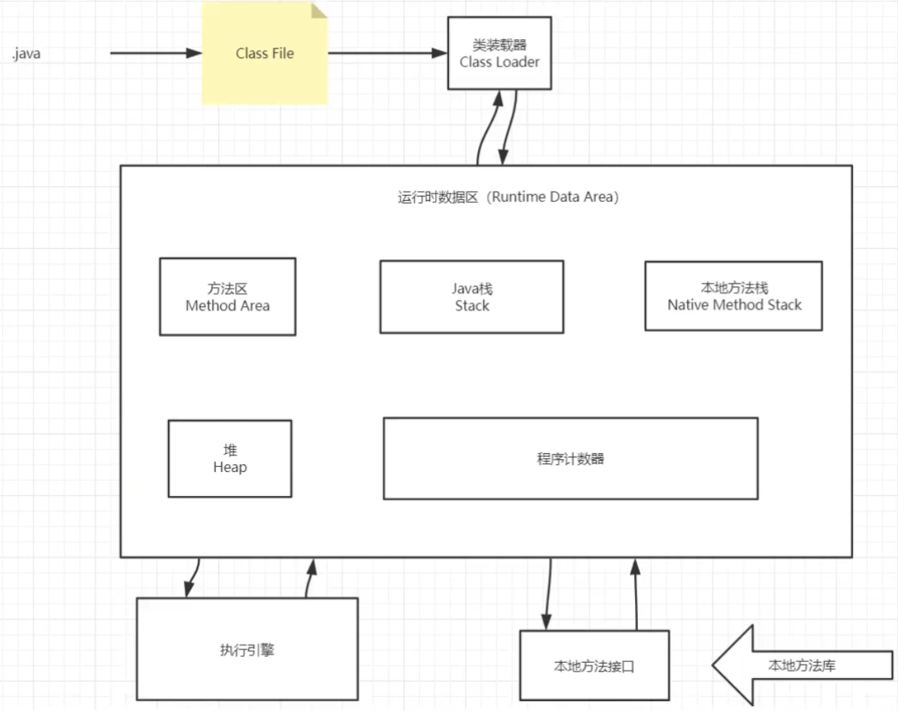
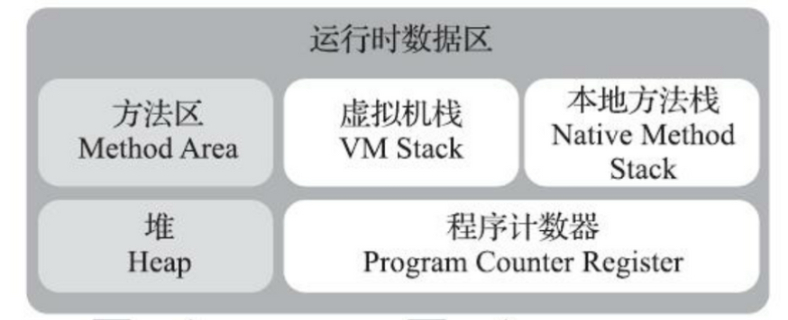

##  第5章 Java底层知识：JVM

### 对java的理解

平台无关性/GC/语言特性：范型，反射，lamda/面向对象/类库/异常处理

### 平台无关性如何实现

.java文件 -- javac编译生成字节码 -- .class文件 -- JVM解析转化成特定平台的执行指令(JVM for Linux, JVM for Win,  JVM for IOS )

#### 为什么不直接将源码解析成机器码

准备工作：每次运行都需要检查，性能受损

兼容性：可以将别的语言解析成字节码

### JVM如何加载.class文件

class loader:依据特定格式，加载class文件到内存

Execution engin:对命令解析

Native interface: 融合其他语言的方法为java所用

### 什么是反射(代码)

### 类从编译到执行的过程

* 编译器将.java 源文件编译成Robot.class字节码

* ClassLoader 将字节码转化为JVM的Class<Robot>对象（

* JVM将Class<Robot>对象实例化成Robot对象

#### ClassLoader

作用：ClassLoader主要在class装载的加载阶段，负责将class文件中的二进制数据流装载进系统，然后交给JVM进行连接、初始化等）

种类

* BootStrapClassLoader: C++编写，加载核心库java.*，用户无法修改
* ExtClassLoader: Java编写，加载扩展库javax.*,用户可见
* AppClassLoader: Java编写，加载程序所在目录
* 自定义ClassLoader: Java编写，定制化加载

#### ClassLoader双亲委派机制

APP —>EXC—>BOOT，自底向上检查是否已经加载，自顶向下加载类

加载过程

* 类加载器收到类加载的请求
* 将这个请求向上委托给父类加载器去完成，一层层向上委托，直到启动类加载器
* 启动加载器检查是否能够加载当前这个类，能加载就结束， 使用当前的加载器，否则， 抛出异常，通知子加载器进行加载
* 重复步骤3

为什么使用双亲委托？

* 为了保证安全，不让程序员故意制造bug
  * 从最内层JVM自带类加载器开始加载,外层恶意同名类得不到加载从而无法使用;
  * 由于严格通过包来区分了访问域,外层恶意的类通过内置代码也无法获得权限访问到内层类，破坏代码就自然无法生效

* 避免多份同样字节码的加载

### 类的加载方式

隐式加载：new

显示加载：loadClass, forName等

#### LoadClass和forName的区别

参考代码（LoadDifference）

* Class.forName得到的class是已经完成初始化的
* ClassLoader.loadClass得到的class是还没有链接的

##### 类的装载过程

* 加载：通过classloader将类加载文件字节码，生成class对象
* 链接
  * 校验：检查加载的class文件安全性和正确性
  * 准备：为类变量分配存储空间并设置类变量(static)初始值(默认值)
  * 解析：JVM将常量池中的符号引用转化为直接引用
* 初始化：执行变量赋值和静态代码块

### Java内存模型

内存： 逻辑地址 --（分段管理机制） -- 线性地址 -- （分页管理机制） -- 物理地址

地址空间的划分：内核空间，用户空间

#### JVM内存模型 

灰色为线程共享数据区，白色为线程私有的

百分之99的JVM调优都是在堆中调优，Java栈、本地方法栈、程序计数器是不会有垃圾存在的；

**程序计数器** ：当前线程所执行的字节码行号指示器；改变字节码的值来选取下一条需要执行的字节码指令；线程私有；对java方法计数，如果是native方法则计数器的值为undefine；不会发生内存泄漏

**java虚拟机栈** ：Java方法执行的内存模型；包含多个栈帧; (参考代码model.ByteCodeSample.java)

* 局部变量表：包含方法执行过程中的所有变量
* 操作数栈：类似于CPU的寄存器，入栈，出栈，复制，交换，产生消费变量

**本地方法栈**：

**元空间和永久代的区别**：元空间使用本地内存，而永久代使用的是jvm的内存；

**元空间的优势** ：字符串常量池在永久代中容易出现性能问题和内存溢出；类和方法的大小难确定，给永久代的大小指定带来困难；永久代加大GC的困难程度；方便hotspot与其他JVM如Jrokit的集成（因为其他虚拟机没有永久代）

**Java堆**：对象实例的分配区域；GC管理的主要区域；

#### JVM三大调优参数的含义

**-Xss**:规定了每个线程虚拟机栈的大小--会影响并发线程数的大小

**-Xms**:堆的初始值,超过后会扩容

**-Xmx**:堆能扩展达到的最大值，一般会将Xms与Xmx设置为一致的，因为扩容事会发生内存抖动影响性能

#### Java内存模型中堆和栈的区别 

##### 内存分配策略

* 静态存储：编译时确定每个数据目标在运行时的存储空间需求，不允许有可变的数据结构，不允许递归等
* 栈式存储：数据区需求在编译时未知，在运行中进入程序模块的时候规定
* 堆式存储：编译时或运行时数据区的需求都无法确定，动态分配

##### Java内存模型中堆和栈的区别 

* 联系：引用对象、数组时，栈里定义变量保存堆中目标的首地址
* 管理方式：栈自动释放，堆需要GC
* 空间大小：栈小于堆
* 碎片相关：栈产生的碎片远小于堆
* 分配方式：栈只支持静态和动态，堆只支持动态分配
* 效率：栈效率比堆高，只有入栈和出栈；栈弱点：不够灵活；堆优点：动态分配，但是底层为双向链表很灵活，操作比栈复杂

##### 元空间、堆、线程独占部分之间的联系

下面代码为例：

#### 不同JDK intern()方法的区别：JDK6和JDK6+

String s = new String("a");

s.intern();

JDK6: 如果字符串常量池先前已经创建出该对象，则返回池中的该字符串的引用。否则，先在常量池中创建此对象的副本，再返回该字符串对象的引用

JDK6+: 如果字符串常量池先前已经创建出该对象，则返回池中的该字符串的引用。否则，如果JAVA堆中已经存在该对象，则将堆中该对象的**引用**添加到常量池并且返回该引用。如果堆中不存在，先在常量池中创建该对象，再返回该字符串对象的引用

