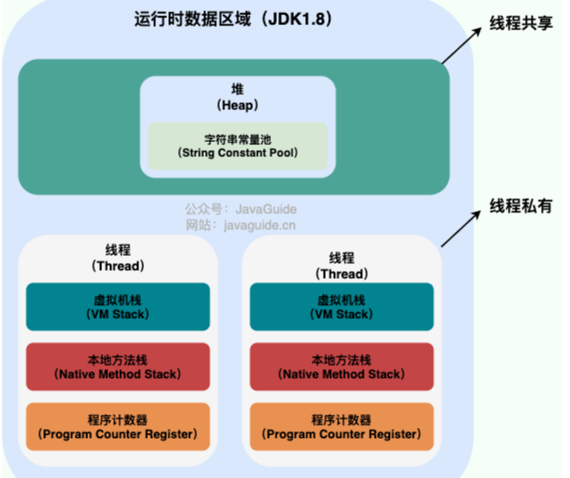
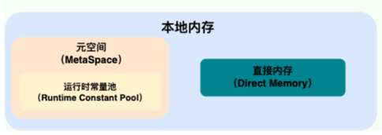
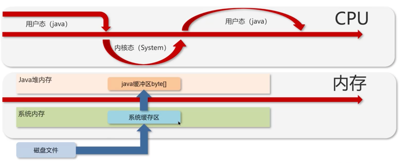
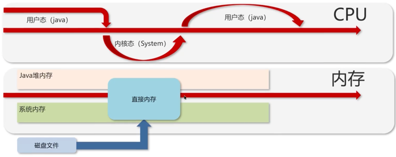
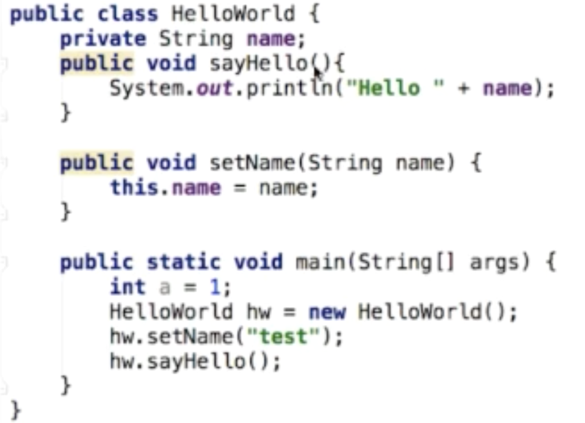
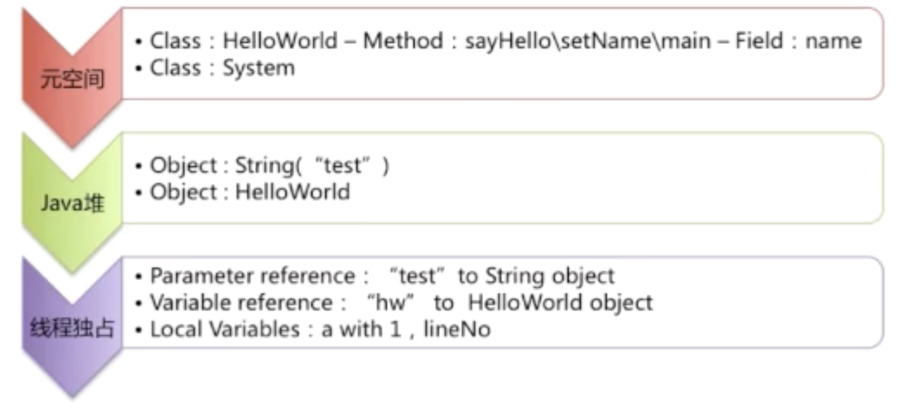
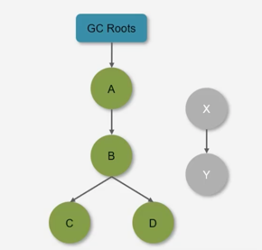
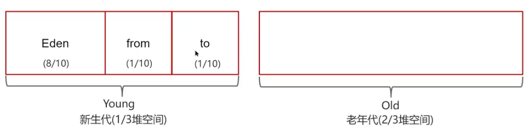

#  第5章 Java底层知识：JVM

## Java内存模型

内存： 逻辑地址 --（分段管理机制） -- 线性地址 -- （分页管理机制） -- 物理地址

### 运行时数据区



JMM把运行时数据区分为两部分：工作内存（线程私有）和主内存（所有线程共享)

百分之99的JVM调优都是在**堆**中调优，Java栈、本地方法栈、程序计数器是不会有垃圾存在的；

#### 程序计数器
线程私有，每个线程一份；保存当前线程所执行的字节码的行号；
* 字节码解释器通过改变程序计数器来依次读取指令，从而实现代码的流程控制，如：顺序执行、选择、循环、异常处理。
* 在多线程的情况下，程序计数器用于记录当前线程执行的位置，从而当线程被切换回来的时候能够知道该线程上次运行到哪儿了。
* 注意：程序计数器是唯一一个不会出现 OutOfMemoryError 的内存区域，它的生命周期随着线程的创建而创建，随着线程的结束而死亡。
* ```javap -y xx.class``` 打印堆栈大小、局部变量的数量和方法的参数。

#### 本地方法栈
本地方法栈则为虚拟机使用到的 Native 方法服务

#### 虚拟机栈
* 每个线程运行时需要的内存，除了一些 Native 方法调用是通过本地方法栈实现的，其他所有的 Java 方法调用都是通过栈来实现的。
* 每个栈由多个栈帧构成，分别对应方法需要的内存（参数，局部变量，返回地址...）
* 每个栈只有一个活动栈帧，对应当前运行的方法
* StackOverFlowError： 栈帧过多，例如循环递归，那么当线程请求栈的深度超过当前 Java 虚拟机栈的最大深度的时候，就抛出 StackOverFlowError 错误。
* OutOfMemoryError： 栈帧过大，那么当虚拟机在动态扩展栈时无法申请到足够的内存空间，则抛出OutOfMemoryError异常。

#### Java堆
保存对象实例，数组等，当堆中没有内存空间给实例时会抛出OOM；GC管理的主要区域（年轻代，老年代）；

### 本地内存
#### 元空间
**元空间的优势** ：字符串常量池在永久代中容易出现性能问题和内存溢出；类和方法的大小难确定，给永久代的大小指定带来困难；永久代加大GC的困难程度；方便hotspot与其他JVM如Jrokit的集成（因为其他虚拟机没有永久代）
* 运行时常量池
  * 常量池可以看作是一张表，虚拟机指令根据这张常量表找到要执行的类名、方法名、参数类型、字面量等信息，储存在.class文件中。 
  * 当该类被加载，它的常量池信息就会放入运行时常量池，并把里面的符号地址变为真实地址。

#### 直接内存
并不在 Java 堆或方法区中分配的，而是通过 JNI 的方式在本地内存上分配的。常见于NIO操作，用于数据缓冲区，它分配的回收成本高但读写性能高。

常规IO拷贝文件流程


NIO拷贝文件流程


### Java内存模型中堆和栈的区别
* 栈内存存储局部方法变量和方法调用，堆内存用于存java对象和数组
* 堆需要GC，栈自动释放
* 栈内存是线程私有的，而堆内存是线程共有的。
* 效率：栈效率比堆高，只有入栈和出栈；栈弱点：不够灵活；堆优点：动态分配，但是底层为双向链表很灵活，操作比栈复杂

#### 元空间、堆、线程独占部分之间的联系

下面代码为例：





### JVM三大调优参数的含义

**-Xss**:规定了每个线程虚拟机栈的大小--会影响并发线程数的大小

**-Xms**:堆的初始值,超过后会扩容

**-Xmx**:堆能扩展达到的最大值，一般会将Xms与Xmx设置为一致的，因为扩容事会发生内存抖动影响性能

-------
## java 平台无关性如何实现

.java文件 -- javac编译生成字节码 -- .class文件 -- JVM解析转化成特定平台的执行指令(JVM for Linux, JVM for Win,  JVM for IOS )

## ClassLoader 类加载器
JVM 只运行二进制文件，类加载器就是将.class加载到JVM中，使程序能够运行起来
### 分类
**BootStrapClassLoader** 启动类加载器
* C++编写，加载核心库```JAVA_HOME/jre/lib```，用户无法修改， 

**ExtClassLoader** 扩展类加载器
* Java编写，加载扩展库```JAVA_HOME/jre/lib/ext```,用户可见

**AppClassLoader** 应用类加载器(默认)
* Java编写，加载程序所在目录```classpath```

**自定义ClassLoader**
* Java编写，定制化加载

### ClassLoader双亲委派机制

App —> Ext—> Boot，自底向上检查是否已经加载，自顶向下加载类

#### 双亲委派过程
* 类加载器收到类加载的请求
* 将这个请求向上委托给父类加载器去完成，一层层向上委托，直到启动类加载器
* 启动加载器检查是否能够加载当前这个类，能加载就使用当前的加载器，否则抛出异常，通知子加载器进行加载
* 重复步骤3

#### 为什么使用双亲委托？
* 避免类被重复加载，如果父类已经加载则子类无需再加载
* 为了保证安全，不让程序员故意制造bug
  * 从最内层JVM自带类加载器开始加载,外层恶意同名类得不到加载从而无法使用;
  * 由于严格通过包来区分了访问域,外层恶意的类通过内置代码也无法获得权限访问到内层类，破坏代码就自然无法生效

## 类装载
### 类的装载过程

1. 加载：通过classloader将类加载文件字节码，生成class对象
2. 链接
   * 校验：检查加载的class文件正确性(格式，语法) 和 安全性(类是否存在)
   * 准备：为类变量(static)分配存储空间并设置类变量初始值(默认值)
   * 解析：JVM将常量池中的符号引用转化为直接引用
3. 初始化：执行变量赋值和静态代码块
4. 使用
5. 卸载

### 类的加载方式
* 隐式加载：new
* 显示加载：loadClass, forName等

### [LoadClass和forName的区别](../src/com/examples/java/reflect/LoadDifference.java)
* Class.forName得到的class是已经完成初始化的
* ClassLoader.loadClass得到的class是还没有链接的

---------
## GC
### 判定对象是否为垃圾的算法
引用计数法和可达性分析算法
#### 引用计数法
对象每次被引用就在对象头上递增一次引用次数，若为0说明可回收。出现循环引用此方法会失效。
#### 可达性分析算法
沿着GC Root如果无法到达则可以被回收(x, y)



* 哪些对象可以作为GC Root？
  * 虚拟机栈(栈帧中的局部变量表)中引用的对象
  * 本地方法栈(Native 方法)中引用的对象
  * 方法区中类静态属性引用的对象
  * 方法区中常量引用的对象
  * 所有被同步锁持有的对象

### 垃圾回收算法

| 算法       | 工作流程                 | 主要优点        | 主要缺点                         | 典型应用场景  |
|-----------|--------------------------|-------------|------------------------------|---------------|
| 标记清除算法   | 标记可达对象 → 清除未标记对象 | 速度快         | 空间碎片化，可导致后续大对象分配失败。          | 老年代 |
| 标记整理算法   | 标记可达对象 → 清除未标记对象 → 整理内存 | 无内存碎片，空间连续  | 需要移动对象，效率较低                  | 老年代（G1、Serial Old） |
| 复制算法    | 将内存分为From/To区 → 复制存活对象到To区 → 清空From区 | 垃圾多时效率高，无碎片 | 分配两块内存空间，同一时刻只使用一半，内存利用率仅50% | 年轻代（Eden/Survivor） |

### 分代收集算法

* 新对象放入Eden区
* Eden内存不足时，标记Eden和From的存活对象
* 将存活对象采用复制算法复制到 to 中，复制完毕后，Eden 和 from 内存都得到释放
* 经过一段时间后Eden的内存又出现不足，标记eden区域to区存活的对象，将存活的对象复制到from区
* 当幸存区对象熬过几次回收（最多15次），就会被移动到老年代(幸存区内存不足或大对象会导致提前晋升）
#### MinorGC, Mixed GC, FullGC的区别是什么
* MinorGC (young GC) 发生在新生代的垃圾回收，暂停时间短
* Mixed GC 新生代 ＋ 老年代部分区域的垃圾回收，G1 收集器特有 
* FullGC：新生代＋ 老年代完整垃圾回收，暂停时间长，应尽力避免

### 垃圾回收器
* JDK 8: Parallel Scavenge（新生代，复制算法）+ Parallel Old（老年代，标记整理算法）
* JDK 9 ~ JDK22: G1(新生代 + 老年代，复制算法)，划分成多个区域，每个区域都可以用作eden/survivor/old
  * 初始标记：短暂停顿（Stop-The-World，STW），标记可达的活跃对象
  * 并发标记：当老年代超过45%时，触发并发标记。 这一阶段可能持续较长时间，取决于堆的大小和对象的数量。
  * 最终标记：短暂停顿（STW），处理并发标记阶段结束后残留的少量未处理的引用变更。
  * 筛选回收：根据标记结果，选择**回收价值高**（存活对象少）的区域，复制存活对象到新区域，回收旧区域内存。这一阶段包含一个或多个停顿（STW），具体取决于回收的复杂度以及预定时间。

### 强引用、软引用、弱引用、虚引用
下面是四种引用类型的对比表格：

| 引用类型  | 垃圾回收时机 | 用途场景 | 示例代码 |
|-------|--------------|----------|----------|
| 强引用   | 当强引用被显式置为null或超出作用域 | 对象的常规状态 | Object obj = new Object(); |
| 软引用   | 内存不足即将OOM时 | 缓存、内存敏感的高速缓存 | SoftReference<Object> softRef = new SoftReference<>(new Object()); |
| 弱引用   | 每次GC时（无论内存是否充足） | 非必需对象、防止内存泄漏 | WeakReference<Object> weakRef = new WeakReference<>(new Object()); |
| 虚引用   | 当关联的对象被GC时，JVM会把引用添加到引用队列中，以便后续处理 | 管理对象的物理资源（如DirectByteBuffer） | PhantomReference<Object> phantomRef = new PhantomReference<>(new Object(), referenceQueue); |

#### 关键特性说明：
1. **强引用（Strong Reference）**：
    - 普通的对象引用，只要强引用存在，对象就不会被回收。
    - 示例：`Object obj = new Object();`

2. **软引用（Soft Reference）**：
    - 由`SoftReference`类实现，用于描述还有用但非必需的对象。
    - 当系统内存不足时，软引用对象会被列入回收范围，进行第二次回收（如果第一次回收后内存仍不足）。
    - 适合实现缓存机制（如网页缓存、图片缓存）。

3. **弱引用（Weak Reference）**：
    - 由`WeakReference`类实现，强度比软引用更弱。
    - 无论内存是否充足，只要发生GC，弱引用对象就会被回收。
    - 典型应用：`ThreadLocal`中的`Entry`使用弱引用避免内存泄漏。

4. **虚引用（Phantom Reference）**：
    - 由`PhantomReference`类实现，必须和引用队列（`ReferenceQueue`）联合使用。
    - 当关联的对象被GC时，JVM会把引用添加到引用队列中，以便后续处理。
    - 主要用于管理直接内存（如`DirectByteBuffer`）的堆外内存回收。