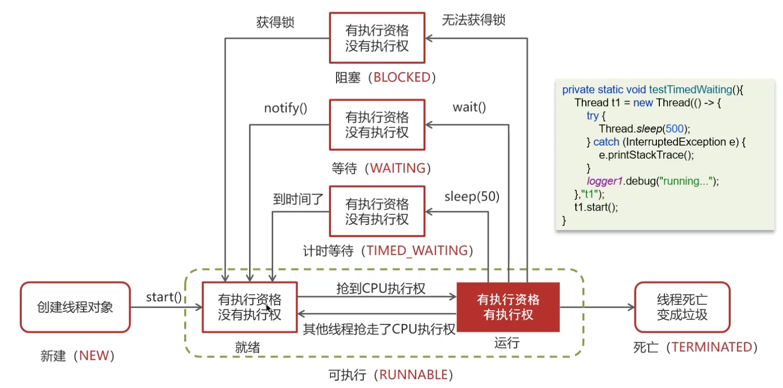

# 第7章 Java多线程

## 进程和线程的区别
* 进程是正在运行的程序实例，进程包含线程，每个线程执行不同的任务
* 不同的进程使用不同的内存空间，当前进程下的所有线程可以共享内存空间
* 线程更轻量，线程上下文切换成本比进程低
* (进程是资源分配的最小单位，线程是CPU调度的最小单位，所有与进程相关的资源都记录在PCB中，线程只由堆栈寄存器，程序计数器，TCB组成)

* 

## Java进程和线程的关系
* JAVA对操作系统提供的功能进行封装，包括线程和进程
* 运行一个程序会产生一个进程，进程包含至少一个线程；一个程序是一个可执行的文件，一个进程是一个执行的实例
* 每个进程对应一个JVM实例，多个线程共享JVM里的堆
* JAVA采用单线程编程模型，程序会自动创建主线程；JVM在创建的时候回同时创建很多其他线程，是多线程的
* 主线程可以创建子线程，原则上要后运行主线程

## 并行和并发的区别
* 并行是同一时间做多件事情，4核CPU同时执行4个线程
* 并发是同一时间应对多件事情，多个线程轮流使用一个或多个CPU

## [创建线程的方法](../src/com/examples/java/thread/CreatThread.java)
1. [继承Thread类](../src/com/examples/java/thread/MyThread.java)
2. [实现Runnable接口](../src/com/examples/java/thread/MyRunnable.java)
3. [实现Callable接口](../src/com/examples/java/thread/MyCallable.java)，适用于需要返回值的情况
4. [使用线程池创建线程](../src/com/examples/java/thread/ThreadPoolDemo.java), 项目中使用

#### Runnable 和 Callable 的区别
* Runnable无返回值
* Callable有返回值，是个范型可以配合FutureTask来获得异步执行的结果
* run方法无抛异常，而call方法可以

#### Thread中start和run的区别：
* start()用来开启线程，通过创建新的子线程来执行run方法（调用了JVM底层的startThread方法，过程如下）。同一个线程start只能执行一次。
```Thread#start() ----> JVM_StartThread ---> thread_entry --->Thread#run() ```
* run()只是一个普通的方法, 会沿用主线程执行方法, 可以调用多次
#### Thread 和 Runnable有什么区别

* 通过Thread类传入runnable，实现多线程

* Thread 是实现了runnable的类，使得run支持多线程

* 因类的单一继承原则，推荐使用Runnable接口

#### 如何给run()方法传参

构造函数传参，成员变量传参，回调函数传参

#### 如何实现处理线程的返回值

* 主线程等待法：需要手动写等待的过程，线程多的话麻烦，无法精准控制时间

* 使用Thread 类 join()方法阻塞当前线程以等待子线程处理完毕: 依赖不够细致

* 通过Callable接口实现：通过FutureTask Or线程池获取  

## 线程有哪些状态，互相之间怎么转换

```java
public enum State {
        NEW,
        RUNNABLE,
        BLOCKED, 
        WAITING,
        TIMED_WAITING,
        TERMINATED
}
```
* 创建线程对象是新建状态new
* 调用start方法变成可运行runnable
* 线程获得了CPU执行权，执行结束后是终止状态terminated
* 在可运行状态中， 如果没有获取的CPU， 可能切换为其他状态
  * 如果没有获取到锁(synchronized/lock), 进入block状态， 获取到锁之后再切换为runnable
  * 如果线程调用了wait()进入等待状态，其他线程调用notify()唤醒后进入runnable
  * 如果线程调用sleep(50)方法进入计时等待状态，时间到后进入runnable

#### 新建多个线程如何保证顺序执行
使用[join()](../src/com/examples/java/thread/Sleep_Yield_Join.java)，此方法会等待当前线程执行结束

#### notify() 和 notifyAll() 区别
* notifyAll() 唤醒所有wait状态的线程
* notify() 只会随机选择一个wait线程
* 补充两个概念：
  * 锁池EntryList：假设线程A已经拥有了某个对象（不是类）的锁，而其他线程B、C想调用这个对象的某个synchronized方法（或者块），由于B、C线程在进入synchronized方法前必须先获得该对象锁的拥有权，而恰巧该对象的锁正在被A使用，此时BC会被阻塞，进入一个地方等待释放锁，这个地方便是该对象的锁池。
  * 等待池WaitSet：假设线程A调用了某个对象的wait()方法，线程A就会释放该对象的锁，同时线程A会进入该随性的等待池中，进入到等待池中的线程不会去竞争该对象的锁。

#### [sleep() 和 wait() 区别](../src/com/examples/java/thread/WaitSleepDemo.java)
相同点： wait(), wait(long), sleep(long) 都是让当前线程放弃CPU使用权进入阻塞状态

不同点：
1. 方法归属不同
   * sleep()是thread类方法
   * wait()是Object类方法, 每个对象都有
2. 醒来时机不同
   * wait(long), sleep(long) 在等待相应毫秒后醒来
   * wait()还可以被notify唤醒
3. 锁特性不同（重点）
   * wait()的调用必须先获取wait对象的锁（wait只能在synchronized方法或者synchronized块中使用），sleep可以在任何地方使用
   * wait()方法执行后会释放锁，允许其他方法获取该锁（我放弃CPU，你们还可以用）
   * sleep()如果在synchronized代码块中使用，不会释放对象锁（我放弃你们也用不了）

#### 如何中断线程
1. 使用[退出标志](../src/com/examples/java/thread/ThreadInterrupt.java)使线程正常退出：在正常运行任务时，经常检查本线程的退出标志flag
2. 调用 [`interrupt()`](../src/com/examples/java/thread/ThreadInterrupt2.java)方法通知线程应该被中断
   * 打断阻塞线程(sleep, wait, join的线程)，线程立刻退出被阻塞状态变成runnable，并抛出`InterruptedException`； 
   * 打断正常活动状态的线程，会根据中断标记```currentThread.isInterrupted()```来判断是否退出，将中断标志设为true。
3. （已弃用的方法）调用stop()方法强制终止/通过suspend()和resume()

#### yield()
Thread.yield()会给当前线程调度器一个当前线程可以让出CPU的暗示（累了爬不动了），但线程调度器可能忽略这个暗示。yield对锁的行为不会有影响，不会让出锁。

