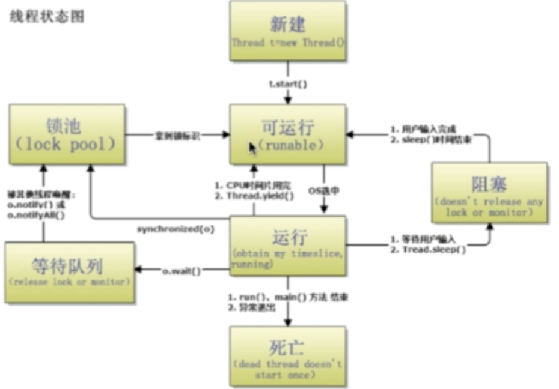

# 第7章 Java多线程与并发

[代码实例](../src/com/examples/java/thread)

## 进程和线程的区别
* 进程是正在运行的程序实例，进程包含线程，每个线程执行不同的任务
* 不同的进程使用不同的内存空间，当前进程下的所有线程可以共享内存空间
* 线程更轻量，线程上下文切换成本比进程低
* 进程是资源分配的最小单位，线程是CPU调度的最小单位，所有与进程相关的资源都记录在PCB中，线程只由堆栈寄存器，程序计数器，TCB组成

* 
## Java进程和线程的关系

* JAVA对操作系统提供的功能进行封装，包括线程和进程
* 运行一个程序会产生一个进程，进程包含至少一个线程；一个程序是一个可执行的文件，一个进程是一个执行的实例
* 每个进程对应一个JVM实例，多个线程共享JVM里的堆
* JAVA采用单线程编程模型，程序会自动创建主线程；JVM在创建的时候回同时创建很多其他线程，是多线程的
* 主线程可以创建子线程，原则上要后运行主线程

## Thread中start和run的区别：

* 调用run会沿用主线程执行方法，只是一个普通的方法调用

* 调用start会创建新的子线程来执行方法，调用了JVM底层的startThread方法（过程如下）

​		Thread#start() ----> JVM_StartThread ---> thread_entry --->Thread#run() 

### Thread 和 Runnable有什么区别

* 通过Thread类传入runnable，实现多线程

* Thread 是实现了runnable的类，使得run支持多线程

* 因类的单一继承原则，推荐使用Runnable接口

### 如何给run()方法传参

构造函数传参，成员变量传参，回调函数传参

### 如何实现处理线程的返回值

* 主线程等待法：需要手动写等待的过程，线程多的话麻烦，无法精准控制时间

* 使用Thread 类 join()方法阻塞当前线程以等待子线程处理完毕: 依赖不够细致

* 通过Callable接口实现：通过FutureTask Or线程池获取  

### 线程的状态

* New新建

* Runnable运行：包含running和ready

* Waiting无限等待：不会分配CPU执行时间，需要被显示唤醒

  没有设置Timeout参数的Object.wait()方法;

  没有设置Timeout参数的Thread.join()方法;

  LockSupport()方法;

* Timed Waiting限期等待

  Thread.sleep();

  设置Timeout参数的Object.wait()方法;

  设置Timeout参数的Thread.join()方法;	

  LockSupport.parkNanos();

  LockSupport.parkUntil();

* Blocked阻塞：等待获取排他锁

* Terminated结束：结束后不能再start()

### sleep()和wait()区别

基本区别：sleep是thread类方法，wait是Object类方法

sleep可以在任何地方使用；wait只能在synchronized方法或者synchronized块中使用

本质区别：Thread.sleep只会让出CPU，不会导致锁行为变化

Object.wait不仅让出CPU还会释放已经占有的同步资源锁

### notify和notifyAll区别

* 两个概念：

  锁池EntryList：假设线程A已经拥有了某个对象（不是类）的锁，而其他线程B、C想调用这个对象的某个synchronized方法（或者块），由于B、C线程在进入synchronized方法前必须先获得该对象锁的拥有权，而恰巧该对象的锁正在被A使用，此时BC会被阻塞，进入一个地方等待释放锁，这个地方便是该对象的锁池。

  等待池WaitSet：假设线程A调用了某个对象的wait()方法，线程A就会释放该对象的锁，同时线程A会进入该随性的等待池中，进入到等待池中的线程不会去竞争该对象的锁。

* notifyAll会让所有处于等待池的线程全部进入锁池竞争获取锁的机会

* notify只会随机选择一个处于等待池的线程进入锁池竞争获取锁的机会

### yield

Thread.yield()会给当前线程调度器一个当前线程可以让出CPU的暗示（累了爬不动了），但线程调度器可能忽略这个暗示。yield对锁的行为不会有影响，不会让出锁。

### 如何中断线程

已弃用的方法：调用stop()方法强制终止/通过suspend()和resume()

目前使用的方法：

* 调用 `interrupt()` 方法通知线程应该被中断

  如果线程处于被阻塞状态，那么线程立刻退出被阻塞状态变成runnable，并抛出`InterruptedException`异常；

  如果线程处于正常活动状态，那么会将中断标志设为true。被设置中断标志的线程将继续正常运行不受影响。

* 需要被调用的线程配合中断

  在正常运行任务时，经常检查本线程的中断标识位，如果中断标志 `running`被设置了false就自行停止线程；

  如果线程处于正常活动状态，那么会将中断标志设为ture。被设置中断标志的线程将继续正常运行不受影响。

### 线程状态间转换

