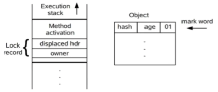
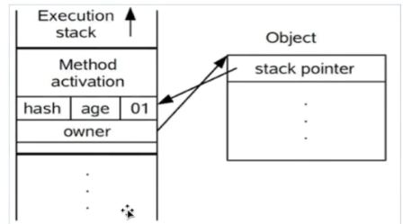
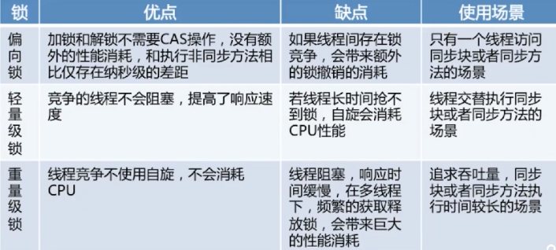

[TOC]

## 第8章 Java多线程与并发-原理

### synchronized

##### 线程不安全的原因

存在共享数据；存在多条线程共享这些共享数据；

##### 互斥锁特性

互斥性：同一时间只允许一个线程持有某个对象锁。也称操作的原子性。

可见性：必须确保释放锁之前对共享变量所做的修改对随后获得该锁的线程是可见的，否则会数据不一致。

锁的不是代码而是对象。

##### 根据获取的锁分类：对象锁 类锁

获取对象锁的两种方法：

	1. 同步代码块：synchronized(this), synchronized(类实例对象), 锁是括号中的实例对象
 	2. 同步非静态方法：synchronized method，锁是当前对象的实例对象

获取类锁的两种方法：

	1. 同步代码块 synchronized(类.class)，锁的是括号里的类对象
 	2. 同步静态方法 synchronized static method，锁是当前对象的类对象

##### 总结

1. 有线程访问对象的同步代码块时，另外的线程可以访问该对象的非同步代码块
2. 若锁住的是同一个对象，一个线程在访问对象的同步代码块时，另一个访问对象同步代码块的线程会被阻塞
3. 若锁住的是同一个对象，一个线程在访问对象的同步方法时，另一个访问对象同步方法的线程会被阻塞
4. 若锁住的是同一个对象，一个线程在访问对象的同步方法时，另一个访问对象同步代码块的线程会被阻塞，反之亦然
5. 同一个类的不同对象的对象锁互不干扰
6. 类锁也是一种特殊的对象锁，因此表述和1234一致，而由于一个类只有一把对象锁，所以同一个类的不同对象使用类锁将会是同步的
7. 类锁和对象锁互不干扰，因为是两个不同的对象锁

### synchronized的底层实现原理

##### 对象在内存中的布局：对象头，实例数据，对齐填充

##### 对象头的结构：Mark word(对象的Hashcode，分代年龄，锁类型，锁标识位) + Class Metadata Address(类型指针指向对象的类元数据，JVM通过这个指针确定该对象是哪个类的数据)

##### Monitor: 每个java对象天生自带了一把看不见的锁，synchronized底层控制了monitor锁

同步代码块的底层是通过ObjectMonitor()实现, monitorenter, monitorexit

同步方法的锁通过 ACC_SYNCHRONIZED标准来判断是否上锁，而没有monitorenter, monitorexit

##### synchronized缺点

早期依赖于mutex lock实现，重量级锁

线程之间的切换要从用户态转换到内核态，开销大

JDK6之后新增了很多锁来优化

### 自旋锁和自适应自旋锁 (锁优化)

##### 自旋锁

很多情况共享数据的锁定状态持续时间很短，切换线程不值得；

通过让线程执行忙循环等待锁的释放，不让出CPU；

缺点：若长时间被其他线程占用会带来很大消耗，可通过PreBlockSpin来控制自旋次数

##### 自适应自旋锁

自旋次数不再固定；

由前一次在同一个锁上的自旋时间及拥有者的状态来决定；

##### 锁消除

虚拟机即时编译器在运行时，会自动检查，对被检测到不可能存在共享数据竞争的锁进行消除。

##### 锁粗化

通过扩大加锁的范围，避免反复加锁解锁

### synchronized的底层实现原理

##### synchronized 四种状态：

* 无锁，偏向锁，轻量级锁，重量级锁（重量级--交给操作系统实现，轻量级--JVM自己实现）

* 锁膨胀的方向：--->

##### 偏向锁：减少同一线程获取锁的代价

* 大多情况下所不存在竞争，总是由同一线程多次获得

* 核心思想：如果一个线程获得了锁，那么锁就进入偏向模式，此时的mark word结构也变为了偏向锁结构，当该线程再次请求锁时，无需再做任何同步操作，即获得锁的过程只需要检查markword的锁标记位为偏向锁以及当前线程id等于markword的ThreadID即可，省去了大量有关锁申请的操作
* 不适用于锁竞争激烈的多线程情况

##### 轻量级锁

* 有偏向锁升级而来，偏向锁运行在一个线程进入同步块的情况下 ，第二个线程加入锁争用时，偏向锁就会升级为轻量级锁。

* 适应场景：线程交替执行同步块

* 若存在同一时间访问同一锁的情况，就会导致轻量级锁膨胀为重量级锁

* 加锁过程

  （1）代码进入同步块时，同步对象处于无锁状态（01），虚拟机先在当前线程的栈帧中建立**锁记录**（Lock Record）的空间，用于储存对象目前的mark word拷贝，官方称为displaced mark word。此时线程堆栈与对象头的状态如下图

  ​	

  （2）拷贝对象头中的mark word复制到锁记录中

  （3）拷贝成功后，虚拟机使用 CAS 操作尝试将锁对象的 Mark Word 更新为指向**锁记录**的指针，并将锁记录里的owner指针指向object mark word。如果更新成功，则执行步骤4，否则执行步骤5

  （4）如果更新成功，线程拥有了该对象的锁，并且对象mark word锁标识位设置为00，即表示轻量级状态。此时线程堆栈与对象头的状态如下图。

  ​	

  （5）如果更新失败，先检查mark word是否指向当前线程的栈帧，如果是就说明当前线程已经拥有该对象的锁，直接进入同步块继续执行。否则说明存在多个线程竞争，轻量级锁会升级为重量级。

* 解锁过程

  （1）通过CAS尝试把线程中复制的displayed maek word对象替换当前的Markword

  （2）如果替换成功则整个同步过程完成

  （3）如果失败说明有其他线程尝试过获取锁（此锁已膨胀），要在释放锁的时候唤醒被挂起的线程

##### 锁的内存语义

* 当线程释放锁，java内存会把该线程对应的本地内存中的共享变量刷新到主内存中

* 当线程获取锁，Java内存模型会把该线程对应的本地内存设置为无效，从而使被监视器保护的临界区代码必须从主内存中读取共享变量。

##### 总结

  

### synchronized和ReentrantLock的区别

* ReentrantLock基于AQS实现（AbstractQueueSynchronizer）acquire, release

* 能够实现更多synchronized更细致的操作，如fairness

* 调用lock()后，必须调用unlock()释放锁

* 性能也不一定比synchronized高，因为后期JDK对synchronized进行了优化

##### ReentrantLock公平性设置（ReentrantLockDemo.java）

* ReentrantLock fairlock = new ReentrantLock(true);

* 参数为true时，倾向于将锁赋予等待时间最久的线程（减少了线程饥饿 - 部分线程长时间等待锁却无法获取）
* 公平锁：获取锁的顺序按照先后调用lock方法的顺序（排队打饭）
* 非公平锁：抢占顺序不一定，看运气
* synchronized是非公平的，公平并不一定就是好，保证公平会增加开销使得吞吐量下降

##### ReentrantLock将锁对象化

* 判断是否有线程，或者某个特定线程，在排队等待获取锁
* 带超时的获取锁的尝试，超时则不再继续获取
* 感知有没有成功获取锁

##### 将wait/notify/notifyAll对象化

* java.util.concurrent.locks.Condition--例如ArrayBlockingQueue （两个condition:notEmpty, notFull）

##### 总结

* synchronized是关键字， ReentrantLock是类
* ReenreantLock可以对获取锁的等待时间进行设置，避免死锁
* ReentrantLock可以获取各种锁的信息
* ReentrantLock可以灵活的实现多路通知
* 机制不同：sync操作对象头的markword，lock调用Unsafe类的park()方法

### jmm的内存可见性 

mm

