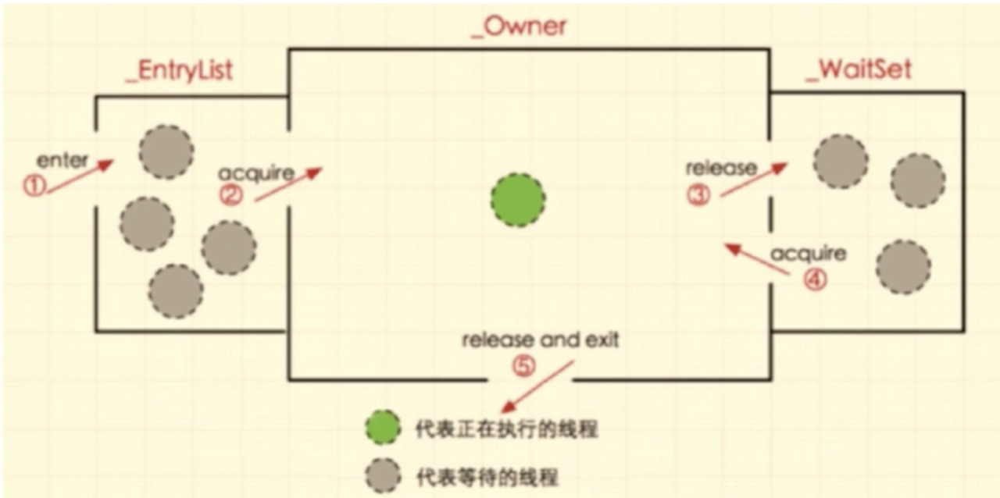
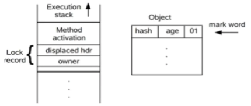
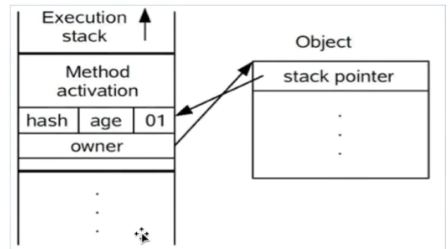
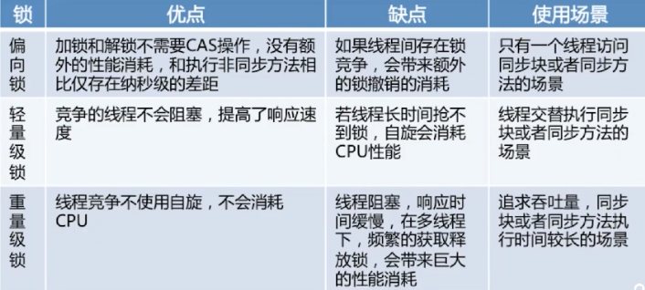

# 第8章 Java并发

## Synchronized
### 对象锁 类锁 使用

#### 获取对象锁的两种方法：

1. 同步代码块 ```synchronized(this)```, ```synchronized(类实例对象)```, 锁是括号中的实例对象
2. 同步非静态方法 synchronized method，锁是当前对象的实例对象

#### 获取类锁的两种方法：
1. 同步代码块 ```synchronized(类.class)```，锁的是括号里的类对象
2. 同步静态方法 ```synchronized static method```，锁是当前对象的类对象

#### 总结
1. 有线程访问对象的同步代码块时，另外的线程可以访问该对象的非同步代码块
2. 若锁住的是同一个对象，一个线程在访问对象的同步代码块时，另一个访问对象同步代码块的线程会被阻塞
3. 若锁住的是同一个对象，一个线程在访问对象的同步方法时，另一个访问对象同步方法的线程会被阻塞
4. 若锁住的是同一个对象，一个线程在访问对象的同步方法时，另一个访问对象同步代码块的线程会被阻塞，反之亦然
5. 同一个类的不同对象的对象锁互不干扰
6. 类锁也是一种特殊的对象锁，因此表述和1234一致，而由于一个类只有一把对象锁，所以同一个类的不同对象使用类锁将会是同步的
7. 类锁和对象锁互不干扰，因为是两个不同的对象锁

### synchronized 底层实现原理

#### 对象的内存结构：
1. 对象头：Mark word(对象的Hashcode，分代年龄，锁类型，锁标识位) + Class Metadata Address(类型指针指向对象的类元数据，JVM通过这个指针确定该对象是哪个类的数据)
2. 实例数据：成员变量
3. 对齐填充

#### Monitor 重量级锁
每个java对象天生自带了一把看不见的锁，每个java对象关联一个monitor对象，使用synchronized给对象上锁后，对象头的mark word就被设置为指向monitor对象的指针。

Monitor结构：
* Owner: 储存当前获取锁的线程，只有一个线程可以获取
* EntryList：关联没有抢到锁的线程，处于blocked状态的线程
* Waitlist: 关联调用wait()方法的线程，处于waiting状态的线程
* 

synchronized代码块的底层是通过ObjectMonitor()实现, ```monitorenter```（上锁）, ```monitorexit```（解锁）
同步方法的锁通过 ACC_SYNCHRONIZED标准来判断是否上锁，而没有monitorenter, monitorexit

### synchronized 四种状态：

无锁，偏向锁，轻量级锁，重量级锁（Monitor锁）：重量级--交给操作系统实现，轻量级--JVM自己实现

#### 偏向锁：减少同一线程获取锁的代价
* 适应场景：大多情况下所不存在竞争，总是由同一线程持有
* 核心思想：如果一个线程获得了锁，那么锁就进入偏向模式，此时的mark word结构也变为了偏向锁结构，当该线程再次请求锁时，无需再做任何同步操作，即获得锁的过程只需要检查markword的锁标记位为偏向锁以及当前线程id等于markword的ThreadID即可，省去了大量有关锁申请的操作

#### 轻量级锁
* 适应场景：线程交替执行同步块
* 由偏向锁升级而来，偏向锁运行在一个线程进入同步块的情况下，第二个线程加入锁争用时，偏向锁就会升级为轻量级锁。
* 若存在同一时间访问同一锁的情况，就会导致轻量级锁膨胀为重量级锁
##### 轻量级锁加锁过程
1. 代码进入同步块时，同步对象处于无锁状态（01），虚拟机先在当前线程的栈帧中建立**锁记录**(Lock Record)，用于储存对象目前的mark word，官方称为displaced mark word。此时线程堆栈与对象头的状态如下图

    

2. 拷贝对象头中的mark word到锁记录中 
3. 拷贝成功后，虚拟机使用 CAS 操作将锁对象的 Mark Word 更新为**锁记录**的地址，并将锁记录里的owner指针指向object mark word。如果更新成功，则执行步骤4，否则执行步骤5 
4. 如果更新成功，线程拥有了该对象的锁，并且对象mark word锁标识位设置为00，即表示轻量级状态。此时线程堆栈与对象头的状态如下图。

   

5. 如果更新失败，先检查mark word是否指向当前线程的栈帧，如果是就说明当前线程已经拥有该对象的锁，直接进入同步块继续执行。否则说明存在多个线程竞争，轻量级锁会升级为重量级。

##### 轻量级锁解锁过程
1. 通过CAS尝试把线程中复制的displayed mark word对象替换当前的Markword 
2. 如果替换成功则整个同步过程完成 
3. 如果失败说明有其他线程尝试过获取锁（此锁已膨胀），要在释放锁的时候唤醒被挂起的线程

#### 总结

  

## Java 内存模型 JMM
* 定义了共享内存中多线程程序读写操作的规范
* JMM把内存分为两部分：工作内存（线程私有）和主内存（所有线程共享）
* 线程之间是相互隔离的，线程间交互需要通过主内存

## CAS（compare and swap）
* 基于乐观锁实现，在无锁的情况下保证原子性。
* CAS使用到的地方：AQS框架，AtomicXX
* 因为没有加锁，不会阻塞，效率高；如果竞争激烈，重试频繁发生，效率受影响
```java
   while (true) {
       // 1. 获取当前值 A
       int expected = currentValue;
       // 2. 计算新值 B
       int newValue = expected + 1;
       // 3. CAS 操作：如果当前值仍然是 A，则更新为 B；否则重试（当且仅当旧的预期值和内存中的值相同时才会修改成功）
       if (compareAndSwap(currentValue, expected, newValue)) {
           break; // 更新成功
       }
   }
```

## 自旋锁和自适应自旋锁 (锁优化)

### 自旋锁

很多情况共享数据的锁定状态持续时间很短，切换线程不值得；

通过让线程执行忙循环等待锁的释放，不让出CPU；

缺点：若长时间被其他线程占用会带来很大消耗，可通过PreBlockSpin来控制自旋次数

### 自适应自旋锁

自旋次数不再固定；

由前一次在同一个锁上的自旋时间及拥有者的状态来决定；

### 锁消除

虚拟机即时编译器在运行时，会自动检查，对被检测到不可能存在共享数据竞争的锁进行消除。

### 锁粗化

通过扩大加锁的范围，避免反复加锁解锁

## Volatile 
#### 保证线程间的可见性
主要是因为JVM中有一个JIT即时编译器会自动优化代码执行
* 解决方法1: set VM ```-Xint``` 禁用即时编译器，不推荐，得不偿失
* 解决方法2: 在变量前加volatile，告诉JIT不要对此变量进行优化
#### Volatile禁止指令重排序
volatile修饰共享变量会在读、写操作时加入不同的屏障，组织其他操作越过屏障，从而防止指令重排序

## AQS(AbstractQueueSynchronizer) 
* AQS是一种队列同步器，是一种锁机制，作为一个基础框架来使用，例如ReentrantLock就是基于AQS实现的
* AQS内部维护了一个双向队列，队列中储存排队的线程
* AQS内部有一个属性state，默认是0（无锁状态），如果队列中有一个线程将其修改成1就代表获取到了锁
* 多个线程共同修改时，用到CAS来保证原子性
#### 公平锁，非公平锁
公平锁：新线程到队列中等待，只有队列的head获取锁
非公平锁：新线程和队列共同抢资源

## ReentrantLock
### ReentrantLock 实现原理
* ReentrantLock表示可重入的锁，调用lock方法获取锁后，再次调用lock不会阻塞
* 底层 CAS + AQS队列
* 支持公平锁和非公平锁，默认是非公平
  * ```ReentrantLock fairlock = new ReentrantLock(true);```[设为公平](../src/com/examples/java/thread/ReentrantLockDemo.java)

### Synchronized 和 Lock 的区别
#### 语法层面： 
* synchronized 是关键字，由jvm提供；Lock是接口，由jdk提供。
* synchronized 退出代码块会自动释放锁；Lock需要手动调用unlock。
#### 功能层面
* 都属于悲观锁，都具备基本的互斥，可重入，同步功能
* Lock 提供了许多 synchronized 不具备的功能：公平锁，可打断，可设置超时时间（避免死锁），多条件变量
* Lock有适合不同场景的实现，如 ReentrantLock，ReentrantReadWriteLock
#### 性能层面
* 没有竞争时，synchronized做了很多优化：偏向锁，轻量级锁，性能可以
* 竞争激烈时，lock通常有更好性能

## 导致并发出现问题的根本原因是什么（怎么保证多线程的执行安全）
1. 原子性：一个线程在执行中不可暂停，不可中断，要不执行完成，要不不执行
   * Synchronized 同步加锁
   * Lock 加锁
2. 内存可见性: 一个线程对共享变量的修改对另一个变量可见
   * volatile
3. 有序性：指令重排
   * volatile