## 第九章 Java常用类库与技巧

### 面向对象（OOP）
以类的方式组织代码，以对象的形式封装数据
1. **封装**: 将数据和操作数据的方法绑定在一起，隐藏内部实现细节，仅对外提供必要接口。例如，一个 Person 类中，将姓名、年龄等属性设置为私有，通过公有的 get 和 set 方法来访问和修改这些属性。
2. **继承**: 一个类可以继承另一个类的属性和方法，实现代码复用与扩展。如 Student 类继承 Person 类，学生就拥有了人的基本属性和行为，还可以添加学生特有的属性和方法。
3. **多态**：同一个方法调用根据对象不同类型表现出不同行为，通过继承、接口和方法重写实现。比如，不同子类重写父类的 draw 方法，在调用时会根据对象的实际类型执行相应子类的 draw 方法。

* 构造器：和类名相同，没有返回值
  * 作用：new的本质是调用构造器；初始化对象的值
  * 注意：一个类即使不写也会默认有无参构造；一旦定义了有参构造，无参构造就必须显示定义；

* super
  * super调用父类的构造方法，必须在构造方法的第一个
  * super必须出现在子类的方法或者构造方法中
  * super和this不能同时调用构造方法
  * 和this的对比：
    * 代表对象不同：this代表本身调用者这个对象；super代表父类对象的引用
    * 前提不同：this没有继承也可以使用；super在继承条件下才可以使用
    * 构造方法：this()本类的构造；super()父类的构造

* Override：需要有继承关系，子类重写父类的方法
  * 方法名必须相同
  * 参数列表必须相同
  * 修饰符范围可以扩大但能不能缩小public>protected>default>private
  * 抛出的异常：范围可以被缩小但不能被扩大：ClassNotFoundException-->Exception(大)
  * 为什么需要重写？父类的方法子类不一定需要或者不能满足
* 多态
  * 多态是方法的多态，属性没有多态
  * 父类和子类要有联系：类型转换异常 ClassCastException
  * 存在条件：继承关系，方法重写，父类引用指向子类对象
  * static，final，private的方法不能重写
  * Instanceof (类型转换)引用类型
* static
* 抽象类（看demo代码）：具体的实现和规范都有
* 接口：只有规范，没有具体的实现；约束和实现分离

### Java异常体系

异常处理机制可以解决三个问题

* 异常类型 -- 什么被抛出
* 异常堆栈跟踪 -- 在哪里抛出
* 异常信息--为什么被抛出

##### 异常体系

* Error：程序无法处理的系统错误，是JVM需要负担的责任，编译器不做检查，这类错误导致的中断仅靠程序本身是无法恢复的。
* Exception：程序可以处理的异常，捕获后可能恢复
  * RuntimeException：不可预知，程序应自行避免，是程序的责任 (例如用if判断空)
  * 非RuntimeException：可预知，从编译器校验，是编译器的责任（Try Catch）

##### 常见的错误及异常

* RuntimeException: 

  NullPointerException, ClassCastException, IllegalArgumentException, IndexOutOfBoundsException, NumberFormatException

* 非RuntimeException: 

  ClassNotFoundException, IOException

* Error：

  NoClassDefFoundError, StaackOverFlowError, OutOgMemoryError

##### **ClassNotFoundException 和 NoClassDefFoundError 区别**

* 当应用程序运行的过程中尝试使用类加载器去加载Class文件的时候，如果没有在classpath中查找到指定的类，就会抛出ClassNotFoundException。一般情况下，当我们使用Class.forName()或者ClassLoader.loadClass以及使用ClassLoader.findSystemClass()在运行时加载类的时候，如果类没有被找到，那么就会导致JVM抛出ClassNotFoundException。
* 当JVM在加载一个类的时候，如果这个类在编译时是可用的，但是在运行时找不到这个类的定义的时候，JVM就会抛出一个NoClassDefFoundError错误。比如当我们在new一个类的实例的时候，如果在运行时类找不到，则会抛出一个NoClassDefFoundError的错误。
* 加载时从外存储器找不到需要的 Class 就出现 ClassNotFoundException 
* 连接时从内存找不到需要的 class 就出现 NoClassDefFoundError

### Java异常处理机制

https://www.bilibili.com/video/BV1BV411y7zi?p=90

### Java集合框架

##### 数据结构考点

* 数组链表区别
* 链表的操作：反转，环路检测，双向链表，循环链表
* 队列栈的应用
* 二叉树的遍历方式（递归非递归）
* 红黑树的旋转

##### 算法考点

* 内部排序：递归，交换（冒泡，快排），选择，插入
* 外部排序：有限内存配合海量数据
* 哪些排序不稳定？稳定意味着什么？
* 不同数据集各种排序 最好和最差的情况
* 如何优化算法

##### Java集合

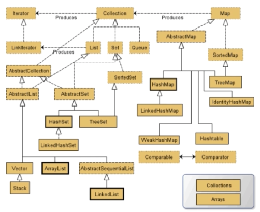

##### list和set

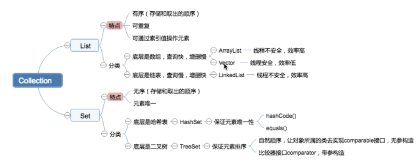

ArrayList：grow()方法扩容，线程不安全

vector: 线程安全，不适合高并发，矛盾，弃用

LinkedList

set不存在equals返回ture的情况

HashSet：底层是HashMap

TreeSet:：排序，navigableMap借口

### Map

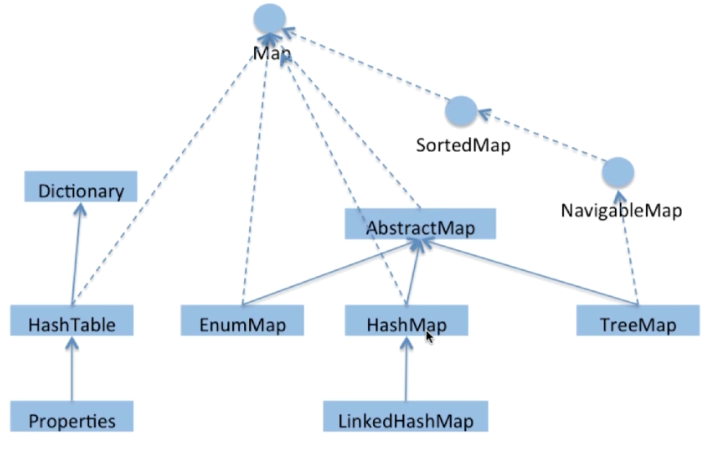

#### HashMap（B站源码课）

数组+链表 +红黑树

##### 参数

TREIFY_THRESHOLD

UNTREIFY_THRESHOLD

modCount 哈希表结构修改的次数(update不算)

threshold扩容阈值：当哈希表的元素超过此值触发扩容，threshold=capacity*loadFactor

loadFactor负载因子 0.75

##### constructor

this.threshold= tableSizeFor(initialCapacity) --  返回一个大于等于当前cap的2的n次方数

##### put()逻辑

1. 如果hashmap未被初始化，则初始化（初始长度16），使用的是延迟创建(lazy)
2. 对key求hash再计算下标
3. 如果没有碰撞则直接放入桶中
4. 有碰撞，按链表接到后面
5. 如果链表长度超过阈值(treeify_threshohld 8)，且总节点超过64，链表转化成红黑树
6. 如果链表长度低于(untreeify_threshohld=6)就把红黑树转回成链表
7. 如果节点(key)已经存在就替换旧值
8. 如果桶满了(容量16*负载因子load_factor0.75)就需要resize（扩容两倍后重排）

##### 如何有效减少碰撞

* 扰动函数：促使元素位置分布均匀减少碰撞
* 使用fianl对象，并采用合适的equals() hashcode()方法

##### 获取散列值的过程(TODO)

为什么容量设置为2的n次？为了在获取散列值时用 与 来替代取模

##### 扩容问题

* 多线程环境下，调整大小会存在竞争，容易造成死锁
* rehashing耗时

#### HashTable

数组+链表，在public方法都加锁了, 并发时效率很低，

#### ConcurrentHashMap

早期使用分段锁segment来实现

现在：CAS+synchronized同步锁，数组+链表+红黑树

##### put()逻辑

1. 判断node[]数组是否初始化，没有则初始化
2. 通过hash定位数组的索引坐标，是否有node节点，如果没有则使用CAS进行添加（链表的头节点），添加失败则进入下次循环
3. 检查到内部正在扩容，就帮助一起扩容
4. 如果f!=null，则使用synchronized锁住f元素（链表/红黑树的头节点）
5. 判断链表长度和阈值，和hashmap树化规则类似

##### 注意（TODO，不常考）

size() 和mappingCount()方法的异同？两者计算是否准确

多线程如何扩容

### J.U.C知识点

提供了并发编程的解决法方案

* CAS是java.util.concurrent.atomic包的基础，自旋锁
* AQS是java.util.concurrent.locks包以及一些常用类Semophore,ReentrantLock的基础

##### JUC包分类

线程执行器 executor，锁lock，原子变量类atomic，并发工具类tools，并发集合collections 

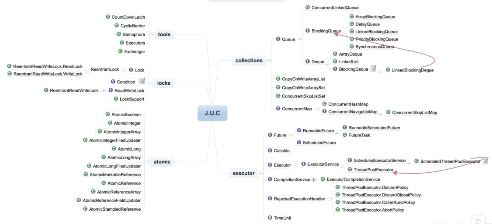


##### 并发工具类Tools

* 闭锁 CountDownLatch：让主线程等待一组事件发生后继续执行

  事件指的是CountDownLatch中的countDown()方法

  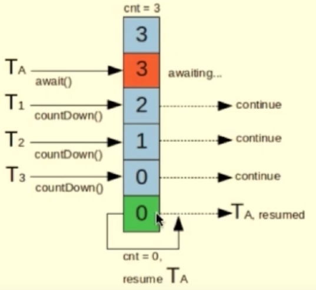

  

* 栅栏 CyclicBarrier：阻塞当前线程，等待其他线程

  所有线程必须同时到达栅栏位置才能继续执行

  所有线程到达栅栏处，可以出发一个预选设置的线程

  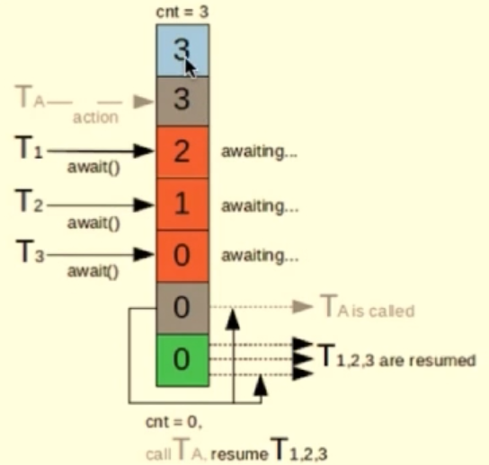

* 信号量 Semaphore：控制某个资源可被同时访问的线程个数

  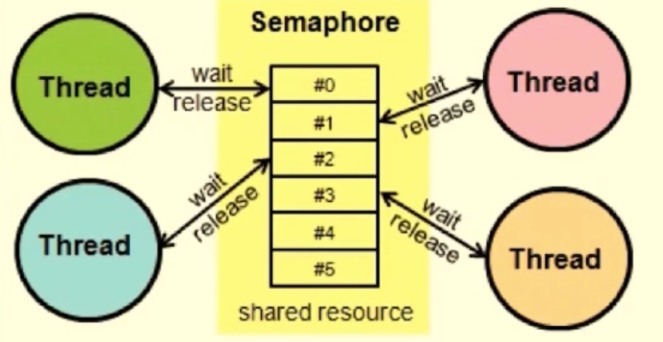

* 交换器 Exchanger：两个线程到达同步点后，相互交换数据

  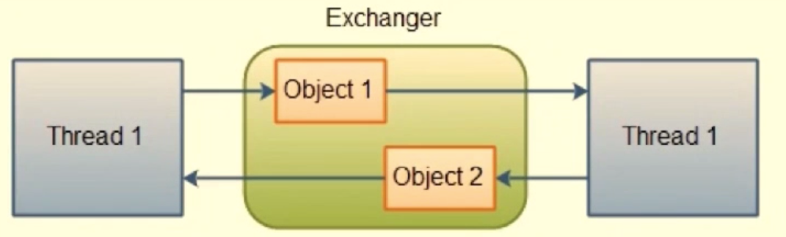

##### BlockingQueue

主要用于生产者消费者模式，在多线程的场景时生产者线程在队尾添加元素，而消费者在队头消费元素，通过这种方式能够达到将任务生产和消费隔离的目的

1. *ArrayBlockingQueue 由数组结构组成的有界阻塞队列*
2. *LinkedBlockingQueue 由链表结构组成的有界/无界阻塞队列*
3. *PriorityBlockingQueue 支持优先级排序的无界阻塞队列*，为空时take()会受阻
4. DealyQueue 使用优先级队列实现的无界阻塞队列
5. SynchronousQueue 不存储元素的阻塞队列
6. LinkedTranserQueue 由链表组成的无界阻塞队列
7. LinkedBlockingDeque 由链表组成的双向阻塞队列

### Java的IO机制：BIO NIO AIO

##### Block-IO：InputStream, OutputStream, Reader, Writer

在IO操作时都被阻塞，代码简单，但效率和扩展性不好

##### NonBlock-IO: 构建多路复用的、同步非阻塞的IO操作

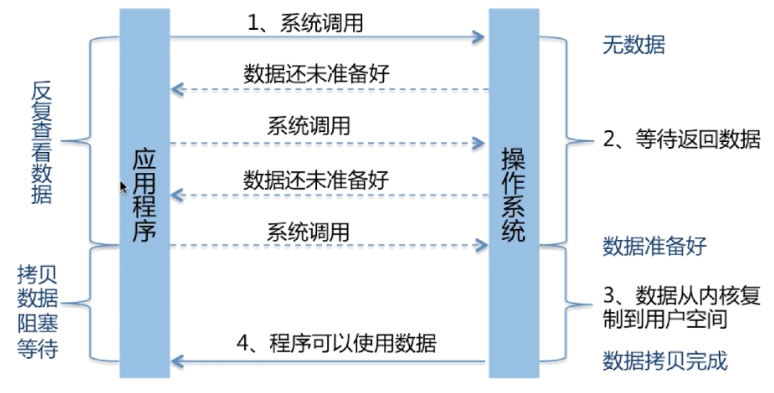

NIO核心：

* Channels
  * FileChannel -  transferTo/transferFrom，避免了两次用户态和内核态的上下文切换，即零拷贝，效率较高

* Buffers
* Selectors：允许单线程处理多个channel,底层使用了操作系统的多路复用select/poll/epoll

IO 多路复用

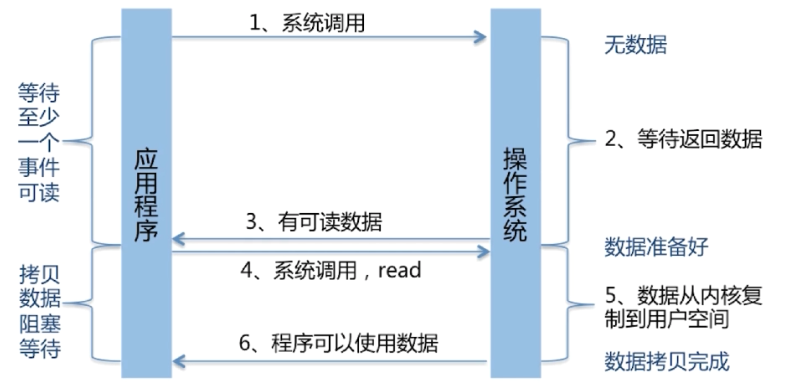

Select/poll/epoll区别

* 支持一个进程所能打开的最大连接数不同
* FD剧增后带来的IO效率问题
* 消息传递方式

##### Asynchronous IO：基于事件和回调机制

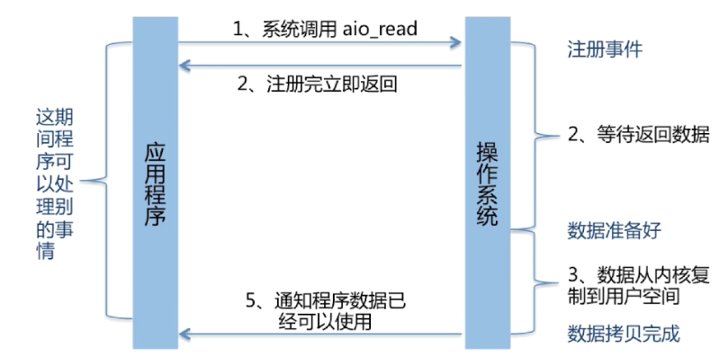

AIO如何进一步加工处理结果？

* 基于回调：实现CompletionHandler接口，调用时触发回调函数
* 基于Future：通过isDone()查看是否准备好，通过get()等待返回数据

| 模型                      | BIO                                        | NIO                                    | AIO                                      |
| ------------------------- | ------------------------------------------ | -------------------------------------- | ---------------------------------------- |
| Blocking                  | 阻塞 同步                                  | 非阻塞 同步                            | 非阻塞 异步                              |
| 线程数（server : client） | 1:1                                        | 1:N                                    | 0:N                                      |
| 复杂度                    | 简单                                       | 较复杂                                 | 复杂                                     |
| 吞吐量                    | 低                                         | 高                                     | 高                                       |
| 使用情形                  | 连接数小且固定的架构，对服务器的要求比较高 | 连接数目多且连接短的架构，如聊天服务器 | 连接数目多且连接较长的架构，如相册服务器 |

### 杂七杂八
* 冯诺伊曼体系
  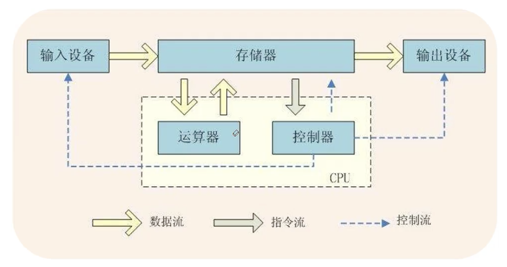

* package必须放在最上面

* 可变参数：在同类参数类型后加省略号，一个方法只能有一个可变参数，并且必须是方法的最后一个参数，多个参数值被当成数组传入。

  ```java
  public static void printMax(int... numbers){
      if(numbers.length==0){
      System.out.println("No argument pass");
    }
    //打印...
  }
  ```

* 稀疏数组

  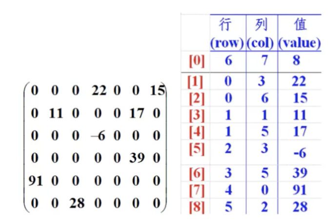

* 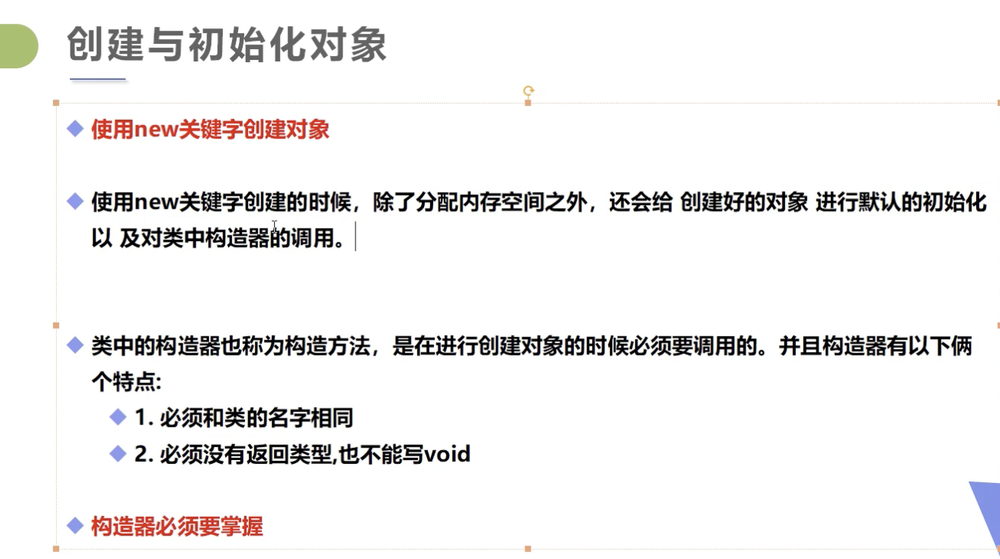
