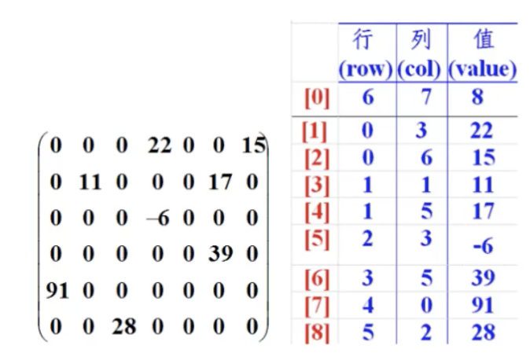
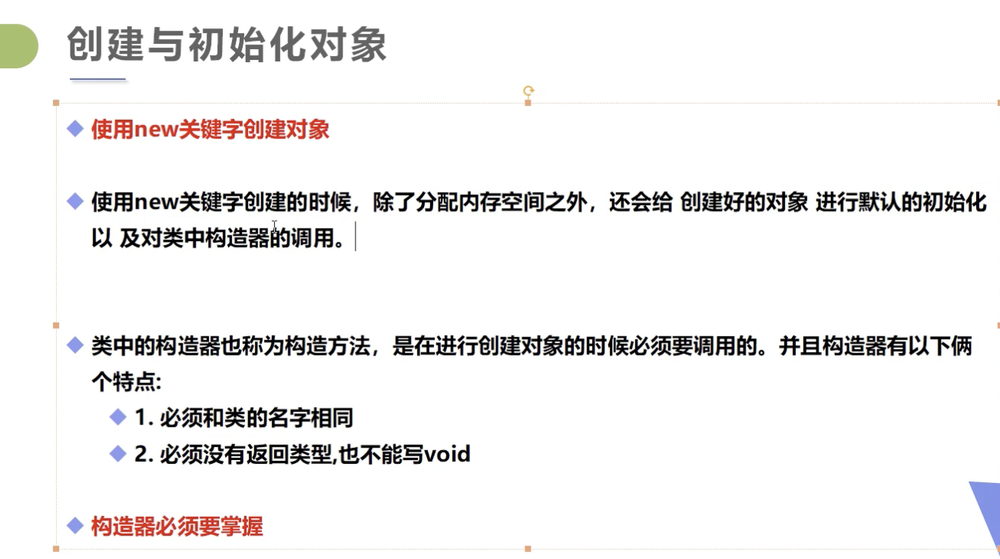

# Java基础


冯诺伊曼体系

packege必须放在最上面

Generate javadoc

* 可变参数：在同类参数类型后加省略号，一个方法只能有一个可变参数，并且必须是方法的最后一个参数

```java
public static void printMax(int... numbers){
	if(numbers.length==0){
    System.out.println("No argument pass");
    return;
  }
  //打印...
}
```

* 稀疏数组

  

  

* 面向对象的本质：以类的方式组织代码，以对象的形式封装数据
  * 封装
  * 继承
  * 多态
* 构造器：和类名相同，没有返回值
  * 作用：new的本质是调用构造器；初始化对象的值
  * 注意：一个类即使不写也会默认有无参构造；一旦定义了有参构造，无参构造就必须显示定义；

* super
  * super调用父类的构造方法，必须在构造方法的第一个
  * super必须出现在子类的方法或者构造方法中
  * super和this不能同时调用构造方法
  * 和this的对比：
    * 代表对象不同：this代表本身调用者这个对象；super代表父类对象的引用
    * 前提不同：this没有继承也可以使用；super在晋城条件下才可以使用
    * 构造方法：this()本类的构造；super()父类的构造
* Override：需要有继承关系，子类重写父类的方法
  * 方法名必须相同
  * 参数列表必须相同
  * 修饰符范围可以扩大但能不能缩小public>protected>default>private
  * 抛出的异常：范围可以被缩小但不能被扩大：ClassNotFoundException-->Exception(大)
  * 为什么需要重写？父类的方法子类不一定需要或者不能满足
* 多态
  * 多态是方法的多态，属性没有多态
  * 父类和子类要有联系：类型转换异常 ClassCastException
  * 存在条件：继承关系，方法重写，父类引用指向子类对象
  * static，final，private的方法不能重写
  * Instanceof (类型转换)引用类型
* static
* 抽象类（看demo代码）：具体的实现和规范都有
* 接口：只有规范，没有具体的实现；约束和实现分离

