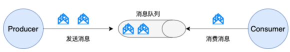
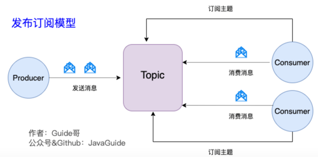

# 消息队列
## 消息队列有什么用？

通常来说，使用消息队列主要能为我们的系统带来下面三点好处：

1. 异步处理：请求中包含的耗时操作，通过消息队列实现异步处理，将对应的消息发送到消息队列之后就立即返回结果，减少响应时间，提高用户体验。随后，系统再对消息进行消费。
2. 削峰/限流：先将短时间高并发产生的事务消息存储在消息队列中，然后后端服务再慢慢根据自己的能力去消费这些消息，这样就避免直接把后端服务打垮掉。 
3. 降低系统耦合性：使用消息队列还可以降低系统耦合性。如果模块之间不存在直接调用，那么新增模块或者修改模块就对其他模块影响较小，这样系统的可扩展性无疑更好一些。

除了这三点之外，消息队列还有其他的一些应用场景，例如实现分布式事务、顺序保证和数据流处理。

-----

## JMS

### JMS 是什么？

JMS（JAVA Message Service,java 消息服务）是 Java 的消息服务，JMS 的客户端之间可以通过 JMS 服务进行异步的消息传输。JMS（JAVA Message Service，Java 消息服务）API 是一个消息服务的标准或者说是规范，允许应用程序组件基于 JavaEE 平台创建、发送、接收和读取消息。它使分布式通信耦合度更低，消息服务更加可靠以及异步性。

JMS 定义了五种不同的消息正文格式以及调用的消息类型，允许你发送并接收以一些不同形式的数据：

* StreamMessage：Java 原始值的数据流
* MapMessage：一套名称-值对
* TextMessage：一个字符串对象
* ObjectMessage：一个序列化的 Java 对象
* BytesMessage：一个字节的数据流

### JMS 两种消息模型

* 点到点（P2P）模型： 使用队列（Queue）作为消息通信载体；满足生产者与消费者模式，一条消息只能被一个消费者使用，未被消费的消息在队列中保留直到被消费或超时。

* 发布/订阅（Pub/Sub）模型： 发布订阅模型（Pub/Sub） 使用主题（Topic）作为消息通信载体，类似于广播模式；发布者发布一条消息，该消息通过主题传递给所有的订阅者。在一条消息广播之后才订阅的用户则是收不到该条消息的。


----

## [Kafka](https://github.com/Snailclimb/JavaGuide/blob/main/docs/high-performance/message-queue/kafka-questions-01.md)
### Kafka 核心概念
1. Producer、Consumer、Broker、Topic、Partition
   * Broker：Kafka 服务器实例，存储消息日志。集群由多个 Broker 组成，每个 Broker 可管理多个 Topic。
   * Topic：消息分类的逻辑概念，数据发布的目的地。物理上分为多个 Partition。 
   * Partition：Topic 的物理分片，消息按顺序存储在分区中，每个分区是一个有序的日志文件。 
   * Replica：Partition 的副本，保障高可用。一个 Partition 有多个 Replica，其中一个为 Leader，其余为 Follower。 
   * Producer：消息生产者，将消息发布到指定 Topic。 
   * Consumer：消息消费者，从 Topic 拉取消息。Consumer 属于 Consumer Group，Group 内的 Consumer 共同消费 Topic 的分区。 
   * ZooKeeper：管理 Kafka 集群元数据（如 Broker 注册、Partition 状态），新版本（Kafka 3.0+）逐步移除对 ZooKeeper 的依赖。
2. 流式处理平台具有三个关键功能：
   * 消息队列：发布和订阅消息流，这个功能类似于消息队列，这也是 Kafka 也被归类为消息队列的原因。
   * 容错的持久方式存储记录消息流：Kafka 会把消息持久化到磁盘，有效避免了消息丢失的风险。
   * 流式处理平台： 在消息发布的时候进行处理，Kafka 提供了一个完整的流式处理类库。

### Kafka 如何保证消息不丢失？
丢失场景：producer发送给broker/broker储存/consumer接收消息
#### 生产者发送消息时丢失
* 设置异步发送（为其添加回调函数）
```java
    ListenableFuture<SendResult<String, Object>> future = kafkaTemplate.send(topic, o);
    future.addCallback(result -> logger.info("生产者成功发送消息到topic:{} partition:{}的消息", result.getRecordMetadata().topic(), result.getRecordMetadata().partition()),
        ex -> logger.error("生产者发送消失败，原因：{}", ex.getMessage()));
```
* 设置重试次数
```java 
prop.put(ProducerConfig.RETRIES_CONFIG, 10);
```

#### 消息在broker中储存时丢失
* 发送确认机制: 设置 acks = **all**:
```text
    acks 是 Kafka 生产者(Producer) 很重要的一个参数。
    acks = 0: 写入消息不等待任何回复
    acks = 1(默认值): 只要 leader 节点接收之后就算被成功发送;
    acks = all： 所有副本全部收到消息，生产者才会接收到来自服务器的响应. 这种模式是最高级别的，也是最安全的，可以确保不止一个 Broker 接收到了消息. 该模式的延迟会很高.
```
* 设置 replication.factor >= 3: 为了保证 leader 有 follower 同步消息，一般会为 topic 设置 replication.factor >= 3。这样就可以保证每个 分区(partition) 至少有 3 个副本。虽然造成了数据冗余，但是带来了数据的安全性。

#### 消费者消费消息时丢失 
消费者默认每隔5s提交一次已经消费的offset
* 禁用自动偏移量提交，改为手动提交(consumer.conmmitAsync();)consumer.conmmitSync();
* 设置 min.insync.replicas > 1: ISR(in-sync replica)需要同步复制保存的follower. 这样配置代表消息至少要被写入到 2 个副本才算是被成功发送。min.insync.replicas 的默认值为 1 ，在实际生产中应尽量避免默认值 1。

### Kafka 如何保证消息的消费顺序？
* 1 个 Topic 只对应一个 Partition。
* （推荐）发送消息的时候指定 Key/Partition：Kafka 中发送消息的时候，可以指定 topic, partition, key, data（数据） 4 个参数。如果你发送消息的时候指定了 Partition 的话，所有消息都会被发送到指定的 Partition。并且，同一个 key 的消息可以保证只发送到同一个 partition，这个我们可以根据业务采用表/对象的 id 来作为 key 。

### Kafka 如何保证消息不重复消费？
#### kafka 出现消息重复消费的原因： 
1. 服务端侧已经消费的数据没有成功提交 offset（根本原因）。 
2. Kafka 侧由于服务端处理业务时间长或者网络链接等等原因让 Kafka 认为服务假死，触发了分区 rebalance。
#### 解决方案：
1. 消费消息服务做幂等校验，比如 Redis 的 set、MySQL 的主键等天然的幂等功能。这种方法最有效。 
2. 将 enable.auto.commit 参数设置为 false，关闭自动提交，开发者在代码中手动提交 offset。那么这里会有个问题：什么时候提交 offset 合适？
   * 处理完消息再提交：依旧有消息重复消费的风险，和自动提交一样;
   * 拉取到消息即提交：会有消息丢失的风险。允许消息延时的场景，一般会采用这种方式。然后，通过定时任务在业务不繁忙（比如凌晨）的时候做数据兜底。

### Kafka 数据清理机制 
* 超过指定时间则被清理（默认7天）
* 根据topic储存的数据大小，超过则删除最老的（默认关闭）