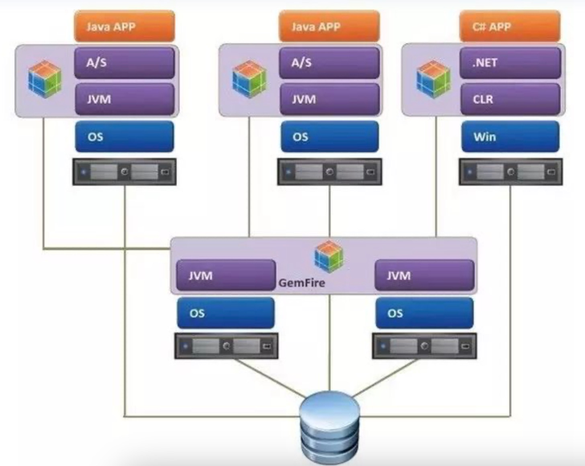
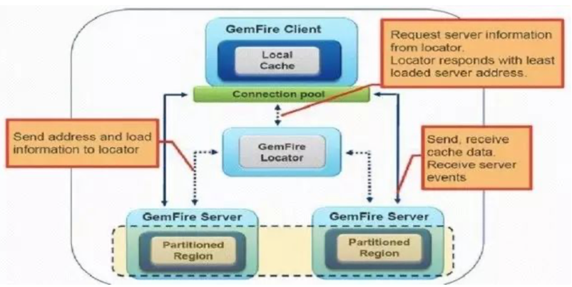
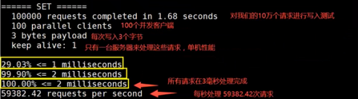

# 缓存（Gemfire/Redis/Apache Ignite）
## NoSql
* 为什么要用NoSql？
    * 90年代基本都是静态网站，访问量不会太大。 现在数据量太大，一个机器放不下/数据的索引(B+树)太大，一个机器放不下/访问量太大(读写混合)
    * MySql --> MemCache+MySql+垂直拆分(读写分离) --> 分库分表+水平拆分+MySql集群
* 什么是NoSql

  泛指非关系型数据库， 很多数据类型：个人信息/地理位置等不需要一个特定的格式，不需要多余的操作就可以横向扩展。```Map<String,Object>```
* NoSql特点：解耦，易扩展，数据之间没有关系/高性能(redis一秒写8w，读11w)/数据类型多样(不需要设计数据库)
* NoSql四大分类：
    * KV键值对（redis）
    * 文档型数据库(bson类似json)：MongoDB,主要用于处理文档
    * 列储存数据库(Hbase)
    * 图储存数据库：不是存图型的，是存关系的（朋友圈社交网络）
-----
## GemFire
GemFire 通过把数据存储在缓存中，减少传统关系型数据库的读写次数（减少IO瓶颈），从而使我们的应用支持更多的并发。
### GemFire 分布式数据储存
* 稳定而高性能的基于内存的数据储存
* 灵活的缓存部署策略： 点对点（P2P/peer to peer), 客户端/服务端, 多集群(WAN)
  * 客户端/服务端结构：缓存层由分布式集群系统来组成，是多数中大型系统首选。 
  
  
* 灵活的region分布式处理： 同一数据集合的数据可以整集多点同步也可以切割后不同点保存，并支持数据实时rebalance，也就是有新的节点加入，数据可以在不重启的情况下重新分割平衡，从而达成真正的数据动态延展。
* 具有持续性的数据高可用性和容错性
### 工作原理
1. 发现机制 

    默认GemFire使用IP多播来发现新成员，然而所有成员间的通信都采用TCP/UDP(Disabled after 10.X)。对于部署环境禁止使用IP多播或者网络跨越多个子网时，GemFire提供备用方法：使用轻量级的定位服务器(locator server)来追踪所有成员的连接。新成员加入集群时，将询问定位服务并建立类似于IP多播的socket到socket的TCP连接。
2. 数据分发
* 每个成员都会创建一个或多个缓存数据区域(data region)，通过区域的划分，我们能给每个区域配置不同的分发属性、内存管理以及数据一致性模型。默认GemFire使用P2P分发模型，每个成员都能和其他任何成员通信。同时根据不同的内网特点，传输层可选TCP/IP或可靠多播(UDP)。在这些配置中，有两个属性很重要，范围(scope)和镜像类型(mirror-type)。
* 配置属性-范围(scope)有四种选项：
  * Local：不分发。那为什么不直接保存到HashMap中。因为GemFire额外提供了数据自动持久化到磁盘、OQL(Object Query Language)查询数据、数据操作的事务等特性。
  * Distribute-no-ack：发送数据给成员1，在发送数据给成员2时不等待成员1的响应。适用于对数据一致性要求不高，并要求低网络延迟的情况。这是GemFire的默认配置，能够提供低延迟、高吞吐，并通过尽快分发来降低数据冲突的概率。
  * Distribute-ack：在发送给成员2前，发送数据并等待成员1的响应。这样每条数据都是同步分发的。
  * Global：分发前在其他成员上获得锁，再分发数据。适用于悲观的应用场景，通过全局锁服务来管理锁的获得、释放和超时。
* 配置属性-镜像类型(mirror-type)：
  * none：仅当缓存中有此数据时才更新，任何其他成员发来的新数据都会被忽略掉。适用于某一数据区域仅用来保存另一区域数据的子集。
  * keys：数据区域仅保存key来节约内存，当真正有请求时再从其他区域抓取数据并保存到本地，之后接受对此数据项的更新。适用于无法预测哪些数据会被某一结点访问的情况。
  * keys-values：真正的镜像，将保存全量数据。适用于需要立即访问所有数据的结点，以及数据冗余备份。 
### 持久化和溢出
持久化(persistence)将整个数据集拷贝到磁盘，当成员出错时可以用来还原数据。而溢出(overflow)保存key在内存中而value保存到磁盘，达到节省内存的目的。两者既可以单独使用，也可以混合使用。
1. 持久化
   * GemFire支持两种写磁盘选项：操作内存数据时同步写，或者固定间隔异步写。后一种只当应用在出错时能够容忍不完整的数据还原时使用。
2. 溢出
   * 当内存不足时，GemFire使用LRU(Least Recently Used)策略来决定是否对某个数据项溢出。
3.混合使用
* 持久化与溢出可以混合使用。所有key-value都备份到磁盘，并且当内存不足时，只保留最近使用过的数据。由于LRU而被移除到磁盘的value不会对磁盘有影响，因为所有数据已被持久化到磁盘上了。

### 核心组件：包括 Locator（服务发现）、Region（数据存储单元）、Cache（缓存实例）。
1. Locator 负责客户端与服务器节点的连接管理，相互发现。怎么确定每个请求过来应该call哪些节点的数据？从Locator中拿到对应节点的信息，再去call对应的节点。每个新加入或者离开的成员都会更新Locator，并从Locator上发现目前可用成员列表。
2. Region 扩展了java map接口，类似于ConcurrentMap， 同时具备了支持查询，事务等特性，Region 支持分区（Partition）、复制（Replicate）等数据分布策略。
    * Replicated region: 每个成员都保存着所有分区的数据，显然这是以空间换时间，适用于小型数据集并且读很频繁的操作。
    * Partitioned region： 每个成员只保存着部分分区的数据，时间换空间，适合大数据的数据集，以及写／修改较多的数据集，并提供给了分布式并行查询，处理, MapReduce。
    * Distributed non-replicated
    * Non-distributed(local)
3. Cache
   * 数据持久化：支持磁盘存储（Disk Store）、备份恢复等机制，保障数据可靠性。复习时需理解不同数据分布策略的适用场景，以及数据持久化在金融交易场景中的重要性。
   * CacheLoader 自定义预加载热点数据的代码。

### OQL（Object Query Language）与索引优化
* OQL 查询：类似 SQL，可以跨分布式节点以及并行查询。
* 如SELECT * FROM /region WHERE condition。
* OQL仅支持COUNT, 不支持其它SUM, MIN, MAX。
* 提供高阶的Join, 大多数No-SQL都不支持，这里因为更类似二维表格，也提供了Join操作， ```SELECT * FROM /Region1 r1, /Region2 r2 WHERE r1.status = r2.status;```
* 索引创建与使用：通过创建合适的索引（单键索引、复合索引），可提升 OQL 查询性能。在 “TPS” 项目中，通过 OQL Index Query 优化交易撮合环节的数据检索，复习时可结合具体查询场景，分析索引优化前后的性能对比。​

------
## Redis(Remote Dictionary Service)
内存储存，持久化；效率高；发布订阅系统；计时器计数器（浏览量）

### redis-benchmark 性能测试工具
* ```redis-benchmark -h localhost -p 6379 -c 100 -n 10000``` 6379端口，100个并发连接， 每个连接1万个请求
* 结果

### redis 基础知识
* redis默认有16个数据库，默认的是第0个，可以使用select切换
* ```keys * ``` 查看当前所有的key
* redis是单线程的，redis是基于内存操作的，cpu不是性能瓶颈，redis的

### redis 核心知识点
* 数据结构：String、Hash、List、Set、Sorted Set的应用场景。
* 持久化机制：RDB（快照）与 AOF（日志追加）的区别，如何选择？ 
* 集群模式：主从复制、哨兵（Sentinel）、集群（Cluster）的原理。
* 缓存穿透、击穿、雪崩的解决方案（布隆过滤器、热点 key 预热等）。
* 常见面试题
  * Redis 如何实现分布式锁？对比setnx与 Redisson 的实现。
  * 缓存和数据库双写一致性如何保证？
* 复习建议
  * 动手搭建 Redis 集群，测试数据持久化配置。
  * 练习用 Redis 实现限流、计数器等场景。