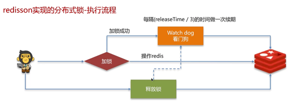
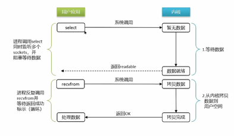
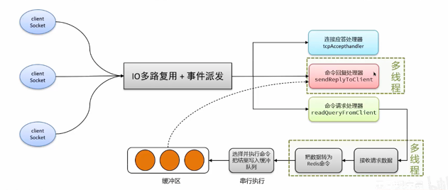

# 缓存（Gemfire/Redis/Apache Ignite）
## NoSql
* 为什么要用NoSql？
    * 90年代基本都是静态网站，访问量不会太大。 现在数据量太大，一个机器放不下/数据的索引(B+树)太大，一个机器放不下/访问量太大(读写混合)
    * MySql --> MemCache+MySql+垂直拆分(读写分离) --> 分库分表+水平拆分+MySql集群
* 什么是NoSql

  泛指非关系型数据库， 很多数据类型：个人信息/地理位置等不需要一个特定的格式，不需要多余的操作就可以横向扩展。```Map<String,Object>```
* NoSql特点：解耦，易扩展，数据之间没有关系/高性能(redis一秒写8w，读11w)/数据类型多样(不需要设计数据库)
* NoSql四大分类：
    * KV键值对（redis）
    * 文档型数据库(bson类似json)：MongoDB,主要用于处理文档
    * 列储存数据库(Hbase)
    * 图储存数据库：不是存图型的，是存关系的（朋友圈社交网络）
-----
## GemFire
GemFire 通过把数据存储在缓存中，减少传统关系型数据库的读写次数（减少IO瓶颈），从而使我们的应用支持更多的并发。
### GemFire 分布式数据储存
* 稳定而高性能的基于内存的数据储存
* 灵活的缓存部署策略： 点对点（P2P/peer to peer), 客户端/服务端, 多集群(WAN)
  * 客户端/服务端结构：缓存层由分布式集群系统来组成，是多数中大型系统首选。 
  
  
* 灵活的region分布式处理： 同一数据集合的数据可以整集多点同步也可以切割后不同点保存，并支持数据实时rebalance，也就是有新的节点加入，数据可以在不重启的情况下重新分割平衡，从而达成真正的数据动态延展。
* 具有持续性的数据高可用性和容错性
### 工作原理
1. 发现机制 

    默认GemFire使用IP多播来发现新成员，然而所有成员间的通信都采用TCP/UDP(Disabled after 10.X)。对于部署环境禁止使用IP多播或者网络跨越多个子网时，GemFire提供备用方法：使用轻量级的定位服务器(locator server)来追踪所有成员的连接。新成员加入集群时，将询问定位服务并建立类似于IP多播的socket到socket的TCP连接。
2. 数据分发
* 每个成员都会创建一个或多个缓存数据区域(data region)，通过区域的划分，我们能给每个区域配置不同的分发属性、内存管理以及数据一致性模型。默认GemFire使用P2P分发模型，每个成员都能和其他任何成员通信。同时根据不同的内网特点，传输层可选TCP/IP或可靠多播(UDP)。在这些配置中，有两个属性很重要，范围(scope)和镜像类型(mirror-type)。
* 配置属性-范围(scope)有四种选项：
  * Local：不分发。那为什么不直接保存到HashMap中。因为GemFire额外提供了数据自动持久化到磁盘、OQL(Object Query Language)查询数据、数据操作的事务等特性。
  * Distribute-no-ack：发送数据给成员1，在发送数据给成员2时不等待成员1的响应。适用于对数据一致性要求不高，并要求低网络延迟的情况。这是GemFire的默认配置，能够提供低延迟、高吞吐，并通过尽快分发来降低数据冲突的概率。
  * Distribute-ack：在发送给成员2前，发送数据并等待成员1的响应。这样每条数据都是同步分发的。
  * Global：分发前在其他成员上获得锁，再分发数据。适用于悲观的应用场景，通过全局锁服务来管理锁的获得、释放和超时。
* 配置属性-镜像类型(mirror-type)：
  * none：仅当缓存中有此数据时才更新，任何其他成员发来的新数据都会被忽略掉。适用于某一数据区域仅用来保存另一区域数据的子集。
  * keys：数据区域仅保存key来节约内存，当真正有请求时再从其他区域抓取数据并保存到本地，之后接受对此数据项的更新。适用于无法预测哪些数据会被某一结点访问的情况。
  * keys-values：真正的镜像，将保存全量数据。适用于需要立即访问所有数据的结点，以及数据冗余备份。 
### 持久化和溢出
持久化(persistence)将整个数据集拷贝到磁盘，当成员出错时可以用来还原数据。而溢出(overflow)保存key在内存中而value保存到磁盘，达到节省内存的目的。两者既可以单独使用，也可以混合使用。
1. 持久化
   * GemFire支持两种写磁盘选项：操作内存数据时同步写，或者固定间隔异步写。后一种只当应用在出错时能够容忍不完整的数据还原时使用。
2. 溢出
   * 当内存不足时，GemFire使用LRU(Least Recently Used)策略来决定是否对某个数据项溢出。
3.混合使用
* 持久化与溢出可以混合使用。所有key-value都备份到磁盘，并且当内存不足时，只保留最近使用过的数据。由于LRU而被移除到磁盘的value不会对磁盘有影响，因为所有数据已被持久化到磁盘上了。

### 核心组件：包括 Locator（服务发现）、Region（数据存储单元）、Cache（缓存实例）。
1. Locator 负责客户端与服务器节点的连接管理，相互发现。怎么确定每个请求过来应该call哪些节点的数据？从Locator中拿到对应节点的信息，再去call对应的节点。每个新加入或者离开的成员都会更新Locator，并从Locator上发现目前可用成员列表。
2. Region 扩展了java map接口，类似于ConcurrentMap， 同时具备了支持查询，事务等特性，Region 支持分区（Partition）、复制（Replicate）等数据分布策略。
    * Replicated region: 每个成员都保存着所有分区的数据，显然这是以空间换时间，适用于小型数据集并且读很频繁的操作。
    * Partitioned region： 每个成员只保存着部分分区的数据，时间换空间，适合大数据的数据集，以及写／修改较多的数据集，并提供给了分布式并行查询，处理, MapReduce。
    * Distributed non-replicated
    * Non-distributed(local)
3. Cache
   * 数据持久化：支持磁盘存储（Disk Store）、备份恢复等机制，保障数据可靠性。复习时需理解不同数据分布策略的适用场景，以及数据持久化在金融交易场景中的重要性。
   * CacheLoader 自定义预加载热点数据的代码。

### OQL（Object Query Language）与索引优化
* OQL 查询：类似 SQL，可以跨分布式节点以及并行查询。
* 如SELECT * FROM /region WHERE condition。
* OQL仅支持COUNT, 不支持其它SUM, MIN, MAX。
* 提供高阶的Join, 大多数No-SQL都不支持，这里因为更类似二维表格，也提供了Join操作， ```SELECT * FROM /Region1 r1, /Region2 r2 WHERE r1.status = r2.status;```
* 索引创建与使用：通过创建合适的索引（单键索引、复合索引），可提升 OQL 查询性能。在 “TPS” 项目中，通过 OQL Index Query 优化交易撮合环节的数据检索，复习时可结合具体查询场景，分析索引优化前后的性能对比。​

------
## Redis(Remote Dictionary Service)
### 面试题
* 使用场景： 缓存(穿透，击穿，雪崩，双写一致，持久化，数据过期，淘汰策略)
* 使用场景： 分布式锁（setnx,redisson）
* 数据类型： 计数器；保存token（String）；消息队列(List)；延迟队列(Set)

### 缓存
一般查询逻辑： 如果缓存中有则直接返回，若没有则查询数据库中的结果在返回（返回之前写入缓存中）

**缓存穿透**： 查询一个不存在的数据， 因此数据也不会写入在缓存中，因此会导致每次请求都查询数据库（一般是由于恶意攻击）
* 解决方法1： 缓存空数据（简单/占内存多）
* 解决方法1：布隆过滤器（占内存少/实现复杂，存在误判）

**缓存击穿**： 给某一个热点key设置了过期时间， 当key过期的时候恰好有大量的对于这个key的请求，这些并发请求可能瞬间把db击穿
* 解决方法1: 添加互斥锁 -- 缓存中没查到则获取锁，知道db查询完毕后在释放锁（保证数据的强一致性/性能低，一次只能有一个线程获取锁）
* 解决方法2: 逻辑过期 -- 不设置过期时间，而是增加一个过期时间的字段，若判断过期则开启新线程重置过期时间，当前线程直接返回过期数据（高可用，更注重用户体验）

**缓存雪崩**： 同一段时间大量的key同时失效或redis宕机导致大量请求涌向数据库
* 解决方法1： 给不同的key设置不同的过期时间，使用随机值
* 解决方法2： Redis集群添加高可用如哨兵模式、集群模式等
* 解决方法3： 给缓存业务添加降级限流策略 nginx或spring cloud gateway中
* 解决方法4： 给业务添加多级缓存，如用caffeine作为一级缓存

**双写一致**：数据如何和redis保持同步呢？两种情况-需要结合业务：一致性要求高/允许延迟
* 一致性要求高
  * 读操作：若缓存中没有时，查询数据库设定超时时间
  * 写操作：延迟双删（因为不论先删除数据库还是缓存都会出问题）： 删除缓存--> 删除数据库-->(延时)删除缓存，但也有脏数据的风险
  * 绝对保证一致： 加锁 读多写少
    * 共享锁：readLock加锁之后其他线程可以读但不能写
    * 排他锁：writeLock阻塞其他线程读和写
* 允许延迟
  * 异步通知保持结果最终一致，使用MQ
  * 基于canal的异步通知，canal是基于mysql的主从同步

**持久化**：两种方式 RDB(Redis数据快照), AOF(Append Only File追加文件)
* RDB
  * 把内存中所有数据都记录在磁盘中
  * 可以在redis.conf中配置触发机制（```save 900 1``` -- 900秒内至少有一个key被修改则执行bgsave）

* AOF
  * redis处理的每一条命令都存在文件里，可以看做命令日志
  * AOF默认是关闭的， 可以在redis.conf打开： ```appendonly yes```
  * 执行频率可配置：```appendfsync always/everysec/no```
  * ```bgrewriteaof```可以让aof文件重写，只保留最后一次操作

**数据过期策略**（key过期会立刻删除吗？）
* 惰性删除：过期时不立刻删除，当需要使用时，检查若过期则删除（CPU友好，内存不友好存放很多已过期的key）
* 定期删除：每隔一段时间进行检查，随机删除一些过期的key。SLOW/FAST两种模式（优：通过限制执行时长和频率来减少删除操作对cpu的影响。缺：难以确定时长和频率）
* Redis是两种策略结合

**数据淘汰策略**（缓存数据过多，内存不够怎么办？）：当Redis内存不够用时，有新的key加入，就会按照某一规则删除一些内存的数据
* ```noeviction```(默认): 满了则不允许加入新key，直接报错
* ```volatile-ttl```: 对于设定了过期时间的key，比较剩余过期时间，淘汰最短的
* ```allkeys-random```：对于所有key随机删除（没有明显冷热数据的场景使用）
* ```volatile-random```：对于设定了过期时间的key随机删除
* ```allkeys-lru```: 删除最近最少使用的（有明显冷热数据的场景优先使用）
* ```volatile-lru```
* ```allkeys-lfu```: 删除最少频率使用的
* ```volatile-lfu```：（有置顶需求的场景优先使用，置顶数据不设置过期时间）

### 分布式锁
使用场景：集群下的定时任务，抢单，幂等性(单体项目加synchronized就可以实现，这个锁是本地锁，集群情况发无法适用需要分布式锁)

**setnx**(set if not exist)
* 获取锁：```SET lock value NX EX 10``: NX是互斥，EX是超时时间，锁需要设置过期时间，防止死锁
* 释放锁：```DEL key``

**Redisson**(如何合理控制锁的失效时间？)：给锁续期：加锁后另开一个watch线程监控锁的状态，每隔一段时间续期一次(默认30s/3=10s续期一次)
* 执行流程
* 可重入：利用hashmap存线程id和重入次数
* 主从一致： RedLock(性能很差，不建议使用)

### Redis集群有哪些方案：主从复制，哨兵模式，分片集群
**主从复制**：实现读写分离，master, slave/replica

主从数据同步原理：
* 全量同步：从节点发送replid&offset请求，主节点根据replication id--数据集标记，每个主节点都有唯一一个replid; offset:偏移量 判断，生成RDB文件并发送
* 增量同步：从节点发送replid&offset，主节点从backlog中找到offset之后的数据并发送

**哨兵模式**（Sentinel）：怎么保证redis高可用？
* 监控：心跳检测不断检查主从节点是否按预期工作
* 实现自动故障恢复：主节点挂机后会有一个slave升级为主节点，选主规则（判断主节点断开的时长，超过则选择从节点；根据slave-priority排序；根据offset排序；根据运行id排序）
* 通知：将新的主节点信息推送给客户端
* 脑裂问题导致数据丢失：
  * 主节点并没有挂，客户端还可以正常连接，只是网络问题导致哨兵没有ping到主节点，从而有了2个主节点；哨兵会强制将老的master降为slave，新的master会把自己的数据清空同步老的数据，导致新数据丢失;
  * 解决方法： 配置最少的从节点为1，否则拒绝客户请求；配置主从同步时间不能超过5s

**分片集群结构**：海量数据存储问题，大量写请求问题
* 多个master，每个存不同的数据， mater直接互相ping心跳
* 客户端可以访问任意节点，最终都会转发给到正确的节点

### IO多路复用
Redis是单线程，为什么还那么快？
* 纯内存操作，执行速度非常快
* 单线程避免不必要的上下文切换开销，多线程还要考虑线程安全
* IO多路复用：Redis的瓶颈时网络延迟，IO多路复用实现了高效的网络请求

**内核空间和用户空间**: 硬盘--（拷贝）--内核空间--（拷贝）--用户进程
* 阻塞IO：两个过程都要等待
* 非阻塞IO：用户进程不等待，直接返回异常，之后再重新请求，不断循坏直到返回有效数据；内核进程依然阻塞；--造成cpu空转
* **IO多路复用**：利用单个线程来监听多个socket，并在某个socket可用时得到通知，避免无效等待
  * 方式： select&poll(通知用户socket就绪，但不知道是哪一个，需要遍历询问)/**epoll**(在socket就绪时同时会把socket写入用户空间)
  * 

### Redis 网络模型
*  IO多路复用 + 不同的事件处理器（连接应答处理器/命令回复处理器/命令请求处理器）
* 
### redis-benchmark 性能测试工具
* ```redis-benchmark -h localhost -p 6379 -c 100 -n 10000``` 6379端口，100个并发连接， 每个连接1万个请求
* 结果
