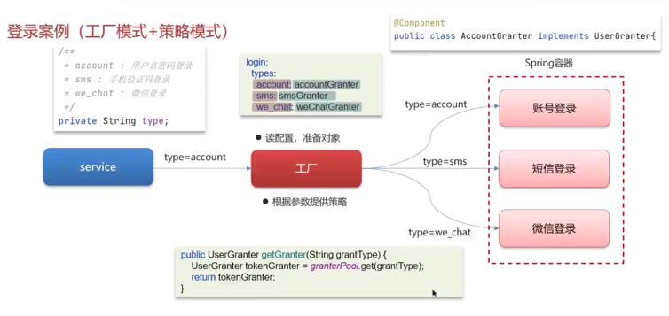

# [设计模式](设计模式.pdf)
## 工厂模式
### 简单工厂
所有产品都依赖同一个工厂，由工厂来创建实例，用户不需要关心创建逻辑，只需传入相应参数。
* 缺点：如果要增加新产品，就需要修改工厂类的判断逻辑，违反开闭原则。
* 例子：Spring 中的 BeanFactory 使用简单工厂模式，根据传入一个唯一的标识来获得 Bean 对象。
### 工厂方法模式
给每个产品都提供了一个工厂，让工厂专门负责相应的产品，符合开闭原则。
### 抽象工厂方法模式
如果有多个维度的产品要配合生产时采用（工厂的工厂）

## 策略模式
策略模式（Strategy Pattern）是一种行为设计模式，它定义了一系列算法，并将每个算法封装起来，使它们可以相互替换，并且算法的替换不会影响客户端。

* 优点：策略之间可以相互替换；易于扩展；避免使用 if else 语句写法。
* 缺点： 客户端必须知道所有的策略类来自行选择使用哪一种
* 例子： 策略模式-根据不同的产品(bond, future, govt)发送给不同的下游系统 + 工厂方法模式-动态创建对应策略，避免硬编码依赖

### **示例代码**
以下是一个使用策略模式实现不同支付方式的示例：

#### **1. 策略接口（支付方式）**
```java
public interface PaymentStrategy {
    void pay(double amount);
}
```

#### **2. 具体策略（具体支付方式）**
```java
// 信用卡支付
public class CreditCardPayment implements PaymentStrategy {
    @Override
    public void pay(double amount) {
        System.out.println("使用信用卡支付：" + amount + "元");
    }
}

// 支付宝支付
public class AlipayPayment implements PaymentStrategy {
    @Override
    public void pay(double amount) {
        System.out.println("使用支付宝支付：" + amount + "元");
    }
}

// 微信支付
public class WechatPayment implements PaymentStrategy {
    @Override
    public void pay(double amount) {
        System.out.println("使用微信支付：" + amount + "元");
    }
}
```

#### **3. 上下文（购物车）**
```java
public class ShoppingCart {
    private PaymentStrategy paymentStrategy;

    public void setPaymentStrategy(PaymentStrategy paymentStrategy) {
        this.paymentStrategy = paymentStrategy;
    }

    public void checkout(double amount) {
        paymentStrategy.pay(amount);
    }
}
```

#### **4. 客户端使用**
```java
public class Client {
    public static void main(String[] args) {
        ShoppingCart cart = new ShoppingCart();

        // 使用支付宝支付
        cart.setPaymentStrategy(new AlipayPayment());
        cart.checkout(100.0);

        // 切换为微信支付
        cart.setPaymentStrategy(new WechatPayment());
        cart.checkout(200.0);
    }
}
```
### 案例（策略 + 工厂）


## 责任链模式
将多个处理者以链条形式串联，每个处理者仅负责自己职责范围内的请求，未处理或需要进一步处理的请求自动传递给下一个处理者，最终实现请求的分步处理或多层校验。
* 优点： 降低了对象之间的耦合；增强了可扩展性；简化了对象之间的连接；责任分担；
* 例子：订单接入校验链 - 订单接入时需依次完成基础合法性校验、账户状态校验、权限校验，任一环节失败则终止流程。
```java
// 订单处理接口
public interface OrderHandler {
    void setNext(OrderHandler next); // 设置下一个处理者
    Result handle(Order order);      // 处理订单
}

// 字段校验处理器
public class FieldValidationHandler implements OrderHandler {
    private OrderHandler next;

    @Override
    public void setNext(OrderHandler next) {
        this.next = next;
    }

    @Override
    public Result handle(Order order) {
        // 校验证券代码、数量、价格等必填字段
        if (order.getSecurityCode() == null || order.getQuantity() <= 0) {
            return Result.fail("订单字段不完整或无效");
        }
        // 字段校验通过，传递给下一个处理器
        return next != null ? next.handle(order) : Result.success();
    }
}

// 账户状态处理器（类似实现）
public class AccountStatusHandler implements OrderHandler {
    // ... 校验账户是否冻结、可用资金是否充足
}

// 责任链组装
public class OrderValidationChain {
    public OrderHandler buildChain() {
        OrderHandler fieldHandler = new FieldValidationHandler();
        OrderHandler accountHandler = new AccountStatusHandler();
        OrderHandler permissionHandler = new PermissionHandler();
        
        // 构建链条：字段校验 → 账户状态 → 权限校验
        fieldHandler.setNext(accountHandler);
        accountHandler.setNext(permissionHandler);
        
        return fieldHandler;
    }
}

// 使用链条处理订单
public class OrderService {
    private OrderHandler validationChain = new OrderValidationChain().buildChain();
    
    public Result processOrder(Order order) {
        return validationChain.handle(order); // 从链条头部开始处理
    }
}
```
